# What Do Developers Tell Their Agents? A Statement-Level Analysis of Agent Instruction Files

## Abstract

AI coding agents are increasingly governed by natural-language instruction
files (CLAUDE.md, AGENTS.md). Prior empirical studies classify these files
by topic at file or section granularity, but do not distinguish
descriptions from directives and do not assess enforceability. We present
the first statement-level analysis: 2,116 statements extracted from 64
highly popular open-source repositories, each classified by content type
(description vs. directive), topic (12 categories), enforcement
level (4 levels: semantic-only, content, per-event, cross-event), and
context requirement (none, project context, or task context).

Four findings emerge in a layered progression. First, **instruction
files are behavioral policies, not documentation**: 64% of statements
are directives, though this majority is invisible at line level (49%)
because directives are terse (3.6 lines) while descriptions are verbose
(6.8 lines). Second, **file-level topic analysis systematically
distorts the picture**: Architecture ranks first by file prevalence in
prior studies but is 77% description; the true directive-dense topics
are Development Process (87% directive) and Implementation Details
(85%). Third, **83% of directives involve system behavior**,
but they require different enforcement mechanisms: content-level
inspection (38%), per-event OS matching (29%), and cross-event state
tracking (16%). Fourth, **the enforcement gap is wider than the
directive-level percentages suggest**: 90% of repositories need
per-event OS enforcement, 81% need cross-event information-flow
tracking, and 43% need all four enforcement layers simultaneously.
Fifth, **most system-level rules are not self-contained**: 74% require
additional context — project structure (64%) or current task intent
(9%) — before they can be translated into concrete enforcement rules,
quantifying the need for an agent-programmable policy interface.

Our annotated dataset and four-axis taxonomy provide a quantitative
foundation for agent harness engineering — not just what topics
developers address, but what specific rules they write, which
mechanisms each rule requires, and what context must be supplied to
make each rule enforceable.

---

## 1. Introduction

AI coding agents such as Claude Code, OpenAI Codex CLI, and GitHub Copilot
Workspace operate as autonomous processes with access to shells, file
systems, package managers, and network services. To guide agent behavior,
project maintainers write natural-language instruction files that are
injected into the agent's context at the start of each session. These files
have rapidly become a standard practice: Chatlatanagulchai et al. report
that 59--67% of instruction files are modified in multiple commits, with
median update intervals of 1--3 days.

Five prior empirical studies have characterized these files along dimensions
of content taxonomy, structural properties, maintenance practices, and
efficiency impact (see Section 7). However, all prior studies classify at
file level or section-heading level, asking "what topics does this file
cover?" None extracts individual rules, distinguishes descriptions from
directives, or assesses whether individual rules are machine-enforceable.

This gap matters at multiple levels. First, instruction files are not
documentation — 63% of their content consists of directives (behavioral
constraints), not descriptions. File-level studies that classify a file
as "Architecture" cannot distinguish 20 architecture descriptions from
20 architecture directives; indeed, we find Architecture is 78%
description, while the true directive-dense topics (Development Process,
Implementation Details) are underrepresented at file level. Second, the
vast majority of these directives (81%) concern system-observable
behavior — commands executed, files accessed, processes spawned — not
just conversational tone. Yet they require different enforcement
mechanisms: linter-level content inspection covers 38% of directives,
per-event OS matching covers another 29%, and 14% require cross-event
state tracking across multiple operations. Third, the enforcement gap
is wider than directive-level percentages suggest: at the repository
level, 94% of projects need per-event OS enforcement, 78% need
cross-event information-flow tracking, and 48% need all four layers
simultaneously. No currently deployed agent enforcement system covers
the cross-event layer.

This paper addresses these gaps with a statement-level analysis. We make
three contributions:

1. A **statement-level taxonomy** that classifies individual statements
   extracted from instruction files along four axes: content type
   (description vs. directive), topic (12 categories adapted from
   Chatlatanagulchai et al.), enforcement level (semantic-only,
   content, per-event, cross-event), and context requirement (none,
   project, task).

2. A **statement-level corpus** of 2,116 statements extracted from
   instruction files in 64 projects, annotated along all four axes and
   released as a public dataset.

3. An **enforceability analysis** that identifies a concrete enforcement
   gap: 14% of directives require cross-event state tracking at the
   OS level, concentrated in Development Process (ordering constraints
   like "run tests before committing") and Testing (cross-file
   consistency like "update tests when behavior changes"). These
   directives map directly to information-flow control primitives
   (label propagation, temporal gates, staleness-aware re-arming),
   providing empirical grounding for OS-level agent harness designs.

---

## 2. Background and Related Work

### 2.1 Agent Instruction Files

Agent instruction files are project-specific natural-language documents
that configure agent behavior. This study focuses on the two formats used
by coding agents with full tool access (shell, file system, network):

- **CLAUDE.md**: used by Claude Code (Anthropic). Loaded from the project
  root and parent directories; treated as context injected into the agent's
  system prompt.
- **AGENTS.md**: used by OpenAI Codex CLI. Similar role and structure.

We exclude copilot-instructions.md (GitHub Copilot) because Copilot
Workspace operates with more constrained tool access, making the
intent-behavior gap less relevant. These files have no formal schema.
Their content ranges from one-line directives ("never push to main") to
multi-page documents covering architecture, build instructions, testing
procedures, and coding standards.

### 2.2 Prior Empirical Studies

Five studies have examined agent instruction files empirically. We
summarize each below; a detailed methodology comparison is in Appendix A.

**Chatlatanagulchai et al. (2025a)** collected 253 CLAUDE.md files from 242
repositories and classified them into 15 topic categories at file
granularity. Two inspectors assigned labels per file (no Cohen's kappa
reported; 9.2% disagreement rate resolved by a third inspector). Top
categories: Build and Run (77.1%), Implementation Details (71.9%),
Architecture (64.8%), Security (8.7%).

**Chatlatanagulchai et al. (2025b)** expanded to 2,303 files across three
tools (Claude, Codex, Copilot). Manual labeling of a 332-file subset
(80.3% raw agreement, no kappa), followed by GPT-5 automated
classification of the full corpus (micro-avg F1 = 0.79). 16 topic
categories; Security 14.5%. The authors note examples of prohibitive
instructions but do not quantify their prevalence.

**Santos et al. (2025)** analyzed 328 CLAUDE.md files from top-100
repositories. Classification at section-heading level by a single author,
verified by two others in a meeting (no reliability metric). 9 SE concern
categories; Software Architecture (72.6%).

**Lulla et al. (2026)** measured the efficiency impact of AGENTS.md files
on 10 repositories / 124 PRs. AGENTS.md reduced median runtime by 28.64%
and output tokens by 16.58%. Compliance was explicitly not measured.

**Liu et al. (2026)** reverse-engineered Claude Code v2.1.88 and found that
CLAUDE.md is treated as context, not policy: there are no hard deny/allow
gates for CLAUDE.md directives. The paper cites Anthropic's internal data
showing a 93% permission-prompt approval rate (not independently verified).

### 2.3 Gaps in Prior Work

All prior corpus studies share three limitations that this study addresses:

**G1: File-level granularity.** Classification is applied to whole files or
section headings. No study extracts individual statements or counts
directives per file. A file classified as "Testing" may contain 1 testing rule or 20; the
studies cannot distinguish these cases.

**G2: Topic-based taxonomy.** Categories describe what a file is *about*
(Architecture, Security, Testing), not what it *demands* (describe,
instruct, constrain). A behavioral constraint like "run tests before
committing" falls under "Testing" alongside non-constraining content like
"the project uses Jest." The studies cannot separate the two.

**G3: No enforceability assessment.** No study asks whether a rule can be
enforced by a deterministic mechanism, or at which layer of the system
stack enforcement is possible.

---

## 3. Research Questions

We pose five research questions, organized from descriptive to analytical.

**RQ1 (Content types): What fraction of instruction-file content is
description vs. directive?**
Prior studies classify by topic but do not distinguish factual descriptions
("this project uses React") from directives ("always use TypeScript for new
files"). RQ1 establishes the base rate of directive content.

**RQ2 (Topic distribution): How do descriptions and directives distribute
across topic categories?**
We apply Chatlatanagulchai et al.'s 16 topic categories at statement level
and cross-tabulate with the description/directive distinction from RQ1.
This reveals how directives are distributed across topics that prior
studies report only at file level.

**RQ3 (Directive density): How many directives does each project contain,
and how are they distributed?**
Prior studies report file-level prevalence ("77% of files contain Build/Run
content") but not directive counts. RQ3 measures the number of directives
per project, enabling distribution analysis (median, mean, skewness).

**RQ4 (Enforcement level): Which directives are system-enforceable, and
at what level?**
We assess each directive using a waterfall decision procedure (Section
4.4) that assigns it to one of four enforcement levels, ordered by
mechanism complexity:
- **Semantic-only**: no system-level observable counterpart; enforcement
  depends entirely on model compliance.
- **Content**: enforceable by inspecting the content of files the agent
  reads or writes (code style, naming, formatting).
- **Per-event**: enforceable by matching a single system operation
  (command execution, file access, network connection) against a pattern.
- **Cross-event**: enforceable only by tracking state accumulated across
  multiple system operations (ordering, lineage, cross-file consistency).

Action-level enforcement (tool-call guards) is not a separate level in
our taxonomy because it is bypassable: agents can reach the same OS
effects through subprocesses, `bash -c`, or direct syscalls, bypassing
the tool-call boundary. Our taxonomy classifies by the *minimum
unbypassable mechanism* required.

**RQ5 (Enforcement requirements): What enforcement mechanisms do different
directive types require?**
For each directive subtype, we characterize the minimum enforcement level
required and the fraction that requires cross-event state tracking. This
enables a layered view of which directives are addressable by existing
mechanisms and which require mechanisms not yet deployed in practice.

**RQ6 (Context requirement): What fraction of system-level directives
require intent-level context to evaluate?**
A system-level directive may be self-contained ("do not run rm -rf") or
may require project context ("run the full test suite before committing"
— which test command?) or task context ("do not update dependencies
without approval" — did the user approve this session?). RQ6 classifies each system-level directive by whether it
needs no additional context, static project context, or dynamic task
context to translate into a concrete rule. This quantifies the need for
an agent-programmable policy interface: directives that require project
or task context cannot be written by an external administrator — only
the agent (which reads the repo and knows the task) can generate them.

---

## 4. Methodology

### 4.1 Dataset Construction

**Sampling frame.** We target public GitHub repositories that contain at
least one agent instruction file (CLAUDE.md or AGENTS.md) in a standard
location (repository root or `.claude/` directory).

**Search strategy.** We search for repositories in the AI agent ecosystem
via GitHub topic and keyword queries (e.g., `topic:ai-agent`,
`topic:coding-agent`, `topic:llm-agent`, `topic:mcp`) rather than
searching for CLAUDE.md files by filename. This targets projects whose
developers actively use coding agents in their development workflow,
producing more mature and substantive instruction files. A direct filename
search (as used by Chatlatanagulchai et al.) would include repositories
where CLAUDE.md was added experimentally or contains minimal content.
The full list of 15 search queries is recorded in the replication package
(`queries.log`).

**Filtering.** From the search results, we apply five exclusion criteria:

1. **Non-code repositories.** Repositories whose primary language is
   null or Markdown, or whose name/topics match documentation patterns
   (awesome-lists, tutorials, prompt collections, skill catalogs).
2. **Fake-star filtering.** The AI agent ecosystem has significant
   star inflation. We exclude repositories where forks > 0.8 x stars
   (fork-bot signal), stars > 40k with open issues < 20 (no community),
   or age < 2 months with stars > 40k (implausible growth). A manual
   blocklist covers confirmed fake/SEO repositories.
3. **Recency.** Repositories created before 2025 are excluded. Coding
   agents with full tool access (Claude Code, Codex CLI) became widely
   available in 2025; repositories created earlier may have added
   instruction files retroactively rather than as part of an
   agent-native development workflow.
4. **Activity.** Repositories with no push activity within 2 weeks of the
   snapshot date are excluded, ensuring the corpus reflects projects
   under active development with agents.
5. **Trivial content.** Instruction files smaller than 500 bytes (pointer
   files, empty stubs) are excluded at the repository level (a repository
   is excluded only if all its instruction files are < 500 bytes; a
   repository with one pointer file and one substantive file is retained).
   Where CLAUDE.md and AGENTS.md are byte-identical, the duplicate is
   counted once.

Critically, we do **not** exclude repositories based on whether they
contain behavioral directives. Repositories with zero directives (all
descriptions) remain in the corpus as honest data points in the
denominator.

All exclusions are logged with reasons (`exclusions.log`) for
reproducibility.

**Snapshot.** All files were collected on 2026-05-23 (UTC). Repository
metadata (stars, primary language, creation date, last push date) was
recorded at collection time.

**Corpus statistics.**

| Statistic | Value |
|---|---|
| Repositories | 64 |
| Instruction files (after dedup) | 84 |
| Total lines | 16,256 |
| Total bytes | 1,136,161 |
| Median file size | 7,052 bytes |
| Mean file size | 13,525 bytes |
| Star range | 9,772 -- 374,052 |
| Primary languages | TypeScript (25), Python (21), Rust (8), Go (5), other (5) |

### 4.2 Statement Extraction and Classification

**Definition.** A *statement* is a coherent unit of content in an
instruction file that expresses a single thought: one factual claim, one
directive, or one constraint. Statements may span one or more lines and
do not necessarily align with markdown structure (a single list item may
contain multiple statements; a statement may span a paragraph).

**Why not automated segmentation.** Mechanical splitting by markdown
structure (list items, paragraphs, sentences) produces poor results:
instruction files vary widely in formatting; a single list item may
contain multiple directives ("never commit secrets or push to main");
and context is often interleaved with directives in the same paragraph.
We therefore use LLM-agent-based extraction, which identifies semantic
boundaries rather than syntactic ones.

**Extraction method.** We use a two-pass LLM agent pipeline. Both passes use
model (Claude Opus 4.6) with temperature 0 and a fixed random seed for
reproducibility. The full prompts are included in the replication package.

**Pass 1: Extraction + classification.** The LLM agent reads the complete
instruction file and outputs a structured YAML document. Each extracted
statement is classified along both taxonomy axes and assessed for
enforceability. The output schema:

```yaml
file: "owner/repo/CLAUDE.md"
statements:
  - id: 1
    lines: [1, 4]             # half-open line range [start, end), includes header + blank line
    text: "# Project CLAUDE.md\n\nThe backend uses Express with TypeScript."
    type: description          # description | directive
    topic: Architecture        # 16 categories from Chatlatanagulchai et al.
    # fields below apply only to directives:
    enforceability: null       # semantic_only | content | per_event | cross_event
    context_required: null     # none | project | task (Axis 4, system-level directives only)
    confidence: null           # high | medium | low

  - id: 2
    lines: [15, 16]
    text: "Run the full test suite before committing."
    type: directive
    topic: Testing
    enforceability: cross_event
    context_required: project  # "test suite" = pytest? jest? project-specific
    confidence: high

  - id: 3
    lines: [22, 25]           # multi-line statement
    text: "Never commit secrets or credentials. Use environment variables for all sensitive configuration."
    type: directive
    topic: Security
    enforceability: cross_event
    context_required: project   # "secrets" / "credentials" unresolved — which files?
    confidence: high

  - id: 4
    lines: [30, 31]
    text: "Prefer const over let."
    type: directive
    topic: Implementation Details
    enforceability: content
    context_required: none     # "const"/"let" is explicit in the directive
    confidence: high
```

The `lines` field records the half-open line range `[start, end)` in the
original file (1-indexed). The union of all line ranges for a file covers
lines 1 through N (total line count) with no gaps or overlaps, ensuring
every line is assigned to exactly one statement. The `text` field
preserves the original file content verbatim, including any headers,
blank lines, or formatting that fall within the line range.

**YAML formatting rules.** The `text` field uses YAML block scalar (`|`)
syntax. The text content must exactly match the source file lines for the
specified range. Quoted strings with `\n` escapes are not used.
Automated scripts must not be used to fill the `text` field; all
annotation is manual to ensure the annotator has read and classified each
statement. A validation script (`validate.py`) checks line-range
coverage (no gaps, no overlaps) and text fidelity (content matches source
after stripping whitespace) for every `statements.yaml` file.

**No batch or pattern-based annotation.** All classification — including
Axis 3 (enforcement level) and Axis 4 (context requirement) — must be
performed by reading each directive individually and applying the
decision procedure. Regular expressions, keyword matching, or other
pattern-based heuristics must not be used to assign labels in bulk.
The decision procedure requires semantic judgment (e.g., whether
"upstream source" maps to a concrete path requires understanding the
project, not matching a regex). The LLM agent prompt explicitly
instructs the model to read each statement, reason about it, and
assign the label; batch shortcuts are prohibited.

**Granularity rules.**

- *Default: one line, one statement.* When source lines are
  independently meaningful (e.g., list items, standalone sentences),
  each line is a separate statement by default. Lines are merged into
  a single statement only when they form a single coherent thought that
  cannot be meaningfully split: a sentence continued across lines, a
  code block with its introductory text, a describtive list of files
  or a multi-line directive that
  expresses one constraint. The burden of proof is on merging, not on
  splitting. In particular, a list of directives under a shared section
  header (e.g., "Style Guide / General Principles") produces one
  statement per list item, not one statement for the entire section.
- *Minimum unit is a line.* Each line belongs to exactly one statement;
  no sub-line splitting is performed. When a line contains multiple
  directives with different topics (e.g., "Never commit secrets or push
  to main directly"), the broader topic is assigned.
- *Formatting is absorbed, not standalone.* Headers, blank lines,
  horizontal rules, HTML comments, and decorative elements (ASCII art
  boxes, emoji markers) belong to the statement they introduce or
  accompany. A section header belongs to the next statement; trailing
  blank lines belong to the preceding statement.
- *Semantically coherent blocks are one statement.* A list or table that
  expresses a single thought (e.g., a file-structure listing, a
  dependency list, a command reference table) is one statement spanning
  all its lines, not one statement per line. If rows in a table have
  different types (some description, some directive), each group of
  same-type rows is a separate statement. This rule applies only to
  descriptive enumerations (directory listings, dependency tables); it
  does not override the default split for independent directives.
- *Code blocks belong to their surrounding statement.* A code block
  that illustrates a directive (e.g., build commands following "Run
  these commands:") is part of that directive. A standalone code block
  (e.g., a file tree) is part of a description.
- *Compound directives with the same topic stay together.* "Never log,
  commit, or expose API keys" is one directive (topic: Security), not
  three. This applies only when a single sentence expresses multiple
  related constraints; separate list items are separate statements even
  if they share the same topic.
- *Lists of independent directives remain separate.* A list where each
  item is a self-contained directive (e.g., "Do not create git stash /
  Do not switch branches / Do not modify worktrees") produces one
  statement per item, because each has independent enforceability.
  This is the common case for markdown list items under a section
  header; merging list items into one statement requires explicit
  justification (e.g., they jointly define a single workflow step).
- *External references are directives.* Lines that point the agent to
  another file ("See AGENT\_INSTRUCTIONS.md for full instructions") are
  directives. The referenced file's content is not analyzed, but the
  reference itself is a statement.
- *Changelogs and version history are descriptions.* Changelog blocks
  are one description statement spanning the entire block. The prompt instructs the LLM agent to: (a) extract every distinct
statement with its line range, (b) classify each using the taxonomy
(Axis 1: type, Axis 2: topic, Axis 3: enforcement level) following the
definitions in Sections 4.3 and 4.4, (c) assign a confidence level, and
(d) preserve the original text verbatim.

**Pass 2: Cross-validation.** A second LLM agent call reads the original file
together with the Pass 1 YAML and directly updates it: adding missed
statements, removing false extractions, and correcting classifications.

**Manual validation.** A stratified random sample of 100 statements
(stratified by agent-assigned type and subtype) is independently examed by
 human annotators using the same taxonomy. Disagreements are resolved by discussion; the
resolution and rationale are recorded.

### 4.3 Taxonomy

Each statement is classified along four dimensions.

**Axis 1: Content type** (speech-act distinction, following Searle 1976).

| Type | Definition | Example |
|---|---|---|
| **Description** | Factual statement about the project. Does not instruct the agent to do or avoid anything. | "The backend uses Express with TypeScript." |
| **Directive** | Statement that instructs the agent to perform, avoid, or condition an action. | "Run tests before committing." |

There is no separate "structural" category. Formatting elements (headers,
blank lines, horizontal rules, HTML comments, decorative ASCII art) are
absorbed into the statement they introduce or accompany. A section header
like `## Testing` belongs to the next statement. Blank lines between
statements belong to the preceding statement. This ensures every line is
classified as part of a description or directive without a third category.

**Decision procedure.** If the statement (ignoring formatting) can be
rephrased as an imperative ("do X", "do not do X", "do X before Y"), it
is a directive. Otherwise it is a description.

**Axis 2: Topic category** (adapted from Chatlatanagulchai et al. 2025b).

We start from the 16-category topic scheme of Chatlatanagulchai et al.
(2025b) and collapse four sparse categories (each n < 30 at
statement level) into their closest parent, yielding 12 analysis
categories: Debugging and Project Management are merged into Development
Process; Performance and UI/UX are merged into Implementation Details.
The resulting 12 categories are: System Overview, AI Integration,
Documentation, Architecture, Implementation Details, Build and Run,
Testing, Configuration & Environment, DevOps, Development Process,
Maintenance, Security. Definitions follow Chatlatanagulchai et al.
(2025b); the full coding guide is in the replication package.

Prior studies applied these categories at file level ("this file contains
Testing content"). We apply them at statement level ("this statement is
about Testing"). This enables cross-tabulation: for each topic category,
what fraction of statements are descriptions vs. directives? This
directly answers how behavioral directives are distributed across the
topic categories that prior studies report.

**Axis 3: Enforcement level** (new, applied only to directives).

Each directive is classified by the enforcement mechanism it requires.
The classification follows a waterfall decision procedure (Figure 0):
each directive enters at the top and exits at the first level whose
predicate it satisfies.

```
Directive
  │
  ▼
┌─────────────────────────────────────┐
│ Q1: Involves system-level behavior? │
│ (files / commands / network)        │
└──────────┬──────────────────────────┘
           │
      No ──┼──► semantic-only
           │    "Be concise." / "Explain reasoning."
      Yes  │
           ▼
┌─────────────────────────────────────┐
│ Q2: Requires static file content    │
│     inspection or system events?    │
│ (code style / naming / format)      │
└──────────┬──────────────────────────┘
           │
      Yes ─┼──► content
           │    "Prefer const over let." / "Use type hints."
      No   │
           ▼
┌─────────────────────────────────────┐
│ Q3: Decidable from a single         │
│     system operation or multiple?   │
│ (one execve / open / connect)       │
└──────────┬──────────────────────────┘
           │
      Yes ─┼──► per-event
           │    "Never push to main." / "Don't rm -rf."
      No   │
           ▼
┌─────────────────────────────────────┐
│ Q4: Requires state across           │
│     multiple operations             │
│ (history / lineage / ordering)      │
└──────────┬──────────────────────────┘
           │
           ┼──► cross-event
                "Run tests before committing."
                "Process that read .env must not connect."
```
*Figure 0. Enforcement-level waterfall. Each directive exits at the
first matching level; the four levels are mutually exclusive and ordered
by enforcement complexity.*

| Level | Definition | Example |
|---|---|---|
| **Semantic-only** | Directive governs only the agent's reasoning, communication, or output presentation. No system-level observable counterpart. | "Always explain your reasoning." / "Be concise." / "Report the full URL at end of task." |
| **Content** | Directive imposes requirements on the *content* of files the agent reads or writes. Enforcement requires inspecting file content, not just the file-access event itself. | "Prefer `const` over `let`." / "Use type hints." / "Commit format: `type(scope): message`." |
| **Per-event** | Directive can be checked by matching a single system operation (command execution, file access, network connection) against a pattern. An agent reading the repository context can determine the concrete pattern. | "Do not run `rm -rf`." / "Never push to main." / "Do not create git worktree." / "Never modify vendor/ files." |
| **Cross-event** | Directive requires state accumulated across multiple system operations. | "A process that read `.env` must not connect to external endpoints." / "Run tests before committing." / "Only modify DB through the migration tool." |

**Axis 4: Context requirement** (new, applied only to system-level directives).

Each system-level directive (content, per-event, or cross-event) is
classified by what additional context an enforcement mechanism needs
beyond the directive text itself to evaluate the rule.

| Level | Definition | Example (from corpus) |
|---|---|---|
| **None** | The directive text is self-contained: all commands, paths, patterns, or constraints needed to write the enforcement rule are explicit in the text. No external lookup required. | "Do not execute `rm -rf`." / "Do not create git worktree." / "Never run `bun publish` directly." (command is explicit) / "NEVER squash merge or rebase merge PRs." (merge strategy is explicit) / "Prefer `const` over `let`." |
| **Project context** | The directive contains an unresolved reference that must be looked up in the repository before the rule can be enforced. An agent can derive this context by reading the repository. | "Run the full test suite before committing." (test suite = `pnpm test:changed`? `pytest`? `bun test`? — must read repo) / "Never modify upstream source code." (upstream = which paths? `vendor/`? `lib/`? — must read repo) / "Run linting before push." (linter = ruff? eslint? clippy? — must read repo) |
| **Task context** | The directive depends on information that changes per invocation — the current user request, whether approval was granted, what the agent is trying to accomplish — and cannot be resolved from the repository alone. | "Do not update dependencies without approval." (was approval given this session?) / "Keep changes focused." (focused on what? depends on current task) / "Do not delete/rename unexpected files; ask if blocking." (what is "unexpected"? depends on current task) / "Unless explicitly requested, prefer stacked commits over amend." (was it requested?) |

The classification is about **information completeness**, not about
whether the rule is universal or project-specific. A directive that
names a project-specific command verbatim ("never run `bun publish`
directly") is **none** because the enforcement pattern (`bun publish`)
is already explicit in the text. A directive that uses a universal
concept but leaves a parameter unresolved ("run the test suite before
committing") is **project** because "test suite" must be resolved to a
concrete command by reading the repository.

**Decision procedure for Axis 4.** The classification follows a
waterfall analogous to Figure 0 (Figure 0b).

```
System-level directive
  │
  ▼
┌─────────────────────────────────────┐
│ Q1: Does the directive text contain │
│ all information needed to write the │
│ enforcement rule?                   │
└──────────┬──────────────────────────┘
           │
      Yes ─┼──► none
           │
      No   │
           ▼
┌─────────────────────────────────────┐
│ Q2: Can the missing information be  │
│ resolved by reading the repository? │
└──────────┬──────────────────────────┘
           │
      Yes ─┼──► project context
           │
      No   │
           ▼
           ──► task context
```
*Figure 0b. Context-requirement waterfall.*

**Compound context.** A directive that requires both project and task
context is classified by the strongest (most dynamic) requirement.
For example, "only modify files related to your current task" requires
project context (which files exist) and task context (what is the
current task); it is classified as **task context** because the task
dependency is the binding constraint.

Four clarifications for borderline cases:

- *Explicit project-specific patterns are none.* A directive that
  spells out a project-specific command, path, or name verbatim is
  **none**, not project. "Never run `bun publish` directly" is none
  because `bun publish` is already the concrete enforcement pattern.
  "Run the test suite before committing" is project because "test
  suite" must be resolved. The test is whether the directive text
  itself is sufficient, not whether the rule is universal.
- *Unresolved domain concepts are project.* A directive like "never
  commit secrets or credentials" is **project**, not none: "secrets"
  and "credentials" are unresolved — which files or patterns constitute
  secrets depends on the project. By contrast, "never commit `.env`,
  `id_rsa`, or files matching `**/credentials/**`" is **none** because
  the patterns are explicit.
- *Approval gates.* Directives containing "unless explicitly
  requested/asked/approved/instructed", "without user approval", or
  "only when the user asks" are **task context**: they gate on a
  per-session user decision that cannot be derived from the repository.
- *Scope-relative constraints.* Directives like "only modify what is
  needed", "keep changes focused", "do not touch unrelated code", or
  "do not make unnecessary changes" are **task context**: what counts
  as "needed", "focused", "related", or "necessary" depends on what the
  user asked the agent to do in the current session. Note: coding
  idioms that use similar language ("avoid explicit type annotations
  unless necessary for exports") are **none** — "necessary" has a
  well-defined meaning in the language community independent of the
  task.

The three levels are ordered by dynamism: none is static, project
context changes per-repository but is stable within a session, task
context changes per-invocation. This directly informs the policy
lifecycle: none → hardcoded rules; project context → agent generates
rules by reading the repo (ActPlane RQ2); task context → agent must
generate or adapt rules per task at runtime (the "control plane"
argument).

### 4.4 Enforcement-Level Assessment

For each directive, we assess the enforcement level using the waterfall
decision procedure shown in Figure 0. The directive enters at Q1 and
exits at the first level whose predicate it satisfies.

**Q1: Does the directive relate to any system-level behavior?**
A directive relates to system-level behavior if it concerns commands
executed, files accessed or modified, network connections, or process
lifecycle. Even if stated abstractly (e.g., "never modify upstream
source"), it is system-level if an agent reading the repository context
can map it to concrete system operations (e.g., "upstream" = files in
`vendor/` directory). If the directive relates ONLY to the agent's
reasoning, communication, or output presentation, it is
**semantic-only**.

Three clarifications for conditional directives:

- *Abstractly-scoped system constraints.* A directive like "when SDK
  changes, run the build script" is system-level if "SDK" can be
  resolved to concrete file paths by reading the repository context
  (e.g., `packages/sdk/**`). Genuinely vague conditions ("when
  necessary", "when appropriate") that cannot be mapped to observable
  state are **semantic-only**.
- *Agent tool calls are observable operations.* MCP tool invocations,
  skill calls, and other agent-framework tool calls produce IPC or
  network events and are therefore system-level, not semantic-only. A
  pure tool-routing preference ("use `nx_workspace` tool first") is
  **per-event**. An ordering constraint on tool calls ("call
  `fetch-docs` MCP tool before writing integration code") is
  **cross-event**.
- *Exception conditions involving conversation state.* A directive like
  "do not commit without explicit user request" has a system-level core
  constraint (match `git commit`) with a conversation-level exception.
  The enforcement level is determined by the core constraint
  (**per-event** in this case), not by the exception. The enforcement
  mechanism defaults to blocking the operation; the exception is handled
  as a permission grant.

**Q2 (for system-level directives): Does enforcement require inspecting
file content?** If the directive imposes requirements on the text content
of files the agent reads or writes (code style, formatting, naming
conventions, commit message format), it is **content**. The
distinguishing feature: enforcement requires reading the file and parsing
its content, not just observing the file-access system call.

**Q3: Can the rule be matched from a single system operation?**
If the directive can be checked by matching one command execution, one
file access, or one network connection against a pattern derivable from
the repository context, it is **per-event**. Examples: matching
`execve("git", ["worktree", ...])`, matching `open("vendor/...")`,
matching `connect(external_ip)`.

**Q4: Does matching require state across multiple operations?**
If checking the directive requires knowing what happened before the
current operation (which files were previously read, which commands
previously ran, the process lineage), it is **cross-event**.

**Compound directives.** A directive that combines multiple
sub-constraints at different levels is classified by the strongest
(hardest to enforce) sub-constraint. For example, "read `cli/README.md`
and verify command help/output behavior alongside unit tests" contains
a semantic-only sub-constraint (read a file) and a cross-event
sub-constraint (verify behavior matches tests after changes); the
directive is classified as **cross-event**.

This procedure assigns each directive to exactly one level.
Enforcement level is included in the inter-rater reliability assessment
(Section 4.6).

### 4.5 Worked Examples

The following examples illustrate the full annotation pipeline from raw
text to final labels.

| Raw text | Axis 1 | Axis 2 (Topic) | Axis 3 (Enforcement) | Axis 4 (Context) | Rationale |
|---|---|---|---|---|---|
| "The backend uses Express with TypeScript." | Description | Architecture | — | — | Factual; no imperative. |
| "Always explain your reasoning before making changes." | Directive | AI Integration | Semantic-only | — | Purely agent-user communication. |
| "Be concise in responses." | Directive | AI Integration | Semantic-only | — | Purely output style. |
| "Prefer `const` over `let`." | Directive | Implementation Details | Content | None | `const`/`let` is explicit in the directive. |
| "Do not execute `rm -rf`." | Directive | Development Process | Per-event | None | Command pattern is explicit. |
| "Do not create git worktree." | Directive | Development Process | Per-event | None | Command pattern is explicit. |
| "Never push to main directly." | Directive | Development Process | Per-event | None | "main" is literal; enforcement pattern is explicit. |
| "Never run `bun publish` directly." | Directive | Development Process | Per-event | None | Project-specific command, but spelled out verbatim — enforcement pattern is self-contained. |
| "NEVER squash merge or rebase merge PRs." | Directive | Development Process | Per-event | None | Merge strategy is explicit (`--squash`, `--rebase`); no lookup needed. |
| "Author: OthmanAdi only. NEVER add `Co-Authored-By:` trailers." | Directive | Development Process | Content | None | Author name and trailer pattern are explicit in the directive text. |
| "Never modify upstream source code." | Directive | Development Process | Per-event | Project | "upstream" is unresolved — which paths? `vendor/`? `lib/`? Must read repo. |
| "Run the full test suite before committing." | Directive | Testing | Cross-event | Project | "test suite" is unresolved — pytest? jest? bun test? Must read repo. |
| "Run linting before push." | Directive | Development Process | Cross-event | Project | "linting" is unresolved — ruff? eslint? clippy? Must read repo. |
| "Only modify DB through the migration tool." | Directive | Development Process | Cross-event | Project | DB path + migration tool name are unresolved; must read repo. |
| "Do not update dependencies without approval." | Directive | Maintenance | Per-event | Task | "approval" = user said OK in this session; per-invocation. |
| "Keep changes focused." | Directive | Development Process | Per-event | Task | "focused" on what? Depends on current task. |
| "Unless explicitly requested, prefer stacked commits over amend." | Directive | Development Process | Per-event | Task | "explicitly requested" = per-session user intent. |
| "Never commit secrets or credentials." | Directive | Security | Cross-event | Project | "secrets" and "credentials" are unresolved — which files/patterns? `.env`? `id_rsa`? Must know the project's secret layout. |
| "Never commit `.env`, `id_rsa`, or files matching `**/credentials/**`." | Directive | Security | Cross-event | None | Patterns are explicit in the directive text; no lookup needed. |

Edge cases:

| Raw text | Axis 1 | Topic | Enforcement level | Rationale |
|---|---|---|---|---|
| "We use Jest. Always run `jest --coverage` before committing." | Split: Description + Directive | Testing / Testing | — / Cross-event | Hybrid: two statements at sentence boundary. |
| "Do not make changes without explaining them first." | Directive | AI Integration | Semantic-only | "Explaining" is purely conversational. |
| "When answering questions, verify in code; do not guess." | Directive | AI Integration | Semantic-only | Reasoning strategy, no system observable. |

Note that the same topic category (e.g., Development Process) can
contain directives at every enforcement level: content ("commit
format"), per-event ("don't create worktree"), cross-event ("only
through migration tool"). This is precisely the cross-tabulation that
prior file-level studies cannot produce.

### 4.6 Annotation Validation

Statement extraction and Axis 1/2 classification were performed by one
author and cross-validated by an independent LLM review pass.
Enforceability annotation (Axis 3) was independently reviewed by both
a Claude and a Codex agent, each producing per-statement disagreements.
Estimated annotation error rate after correction is 5–8%.

---

## 5. Results

### 5.1 RQ1: What fraction of instruction-file content is directive?

#### 5.1.1 RQ1a: By statement count

Of the 2,116 statements extracted from 64 repositories, 1,361 (64.3%) are
directives and 755 (35.7%) are descriptions. The per-repository directive
fraction has a median of 71.0% and mean of 64.3%, indicating that the
majority of instruction-file content is directive rather than
informational. One repository (HKUDS/DeepTutor) contains only descriptions
(0% directives); at the other extreme, alibaba/OpenSandbox is 97%
directives.

| Metric | Value |
|---|---|
| Total statements | 2,116 |
| Description | 755 (35.7%) |
| Directive | 1,361 (64.3%) |
| Statements per repo (median / mean) | 29 / 33.1 |
| Directives per repo (median / mean) | 15 / 21.3 |
| Directive fraction per repo (median) | 71.0% |

Figure 1 shows the per-repository directive fraction sorted from lowest
to highest. The median is 69.6%, and 75% of repositories have a directive
fraction above 50%.


*Figure 1. Per-repository directive fraction (by statement count), sorted.
Red = majority directive; teal = majority description. Dashed line =
median (69.6%).*
*(Script: `docs/tmp/fig_all_rqs.py`)*

#### 5.1.2 RQ1b: By line count

The same question measured by source lines yields a different answer.
Of the 10,209 lines covered by the corpus, 4,957 (48.6%) belong to
directive statements and 5,252 (51.4%) belong to descriptions. The
per-repository median drops to 56.7%.

| Metric | By statements | By lines |
|---|---|---|
| Directive | 1,361 (64.3%) | 4,957 (48.6%) |
| Description | 755 (35.7%) | 5,252 (51.4%) |
| Per-repo median | 71.0% | 56.7% |

The 14.3 percentage-point gap arises because directives are terse (average
3.6 lines per statement) while descriptions are verbose (average 7.0
lines). A typical directive is a one-line list item ("Never push to
main"); a typical description is a multi-line directory listing or
code block.

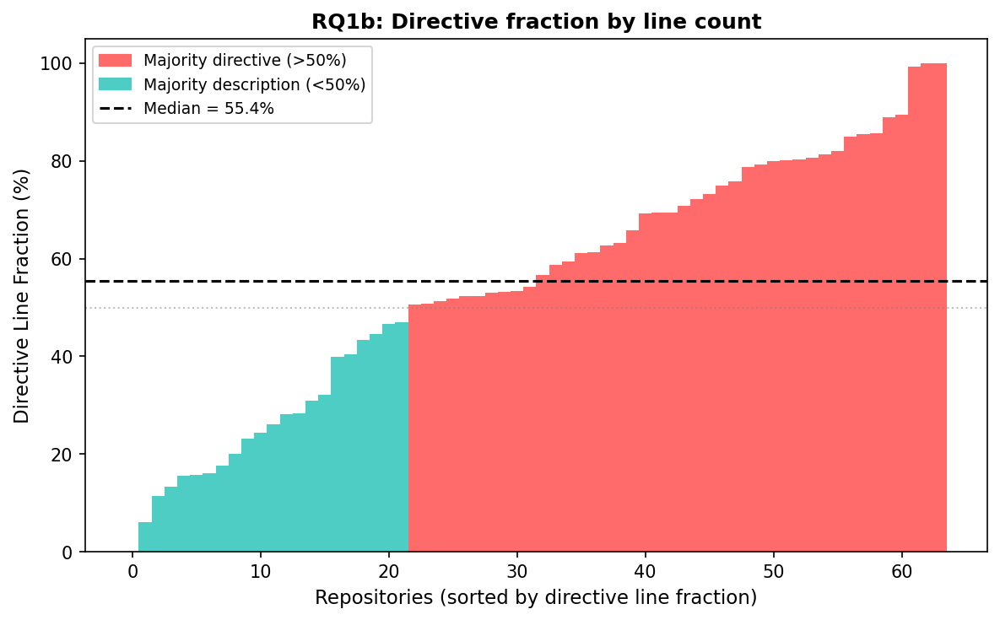
*Figure 2. Per-repository directive fraction (by line count), sorted.
Compared to Figure 1, fewer repos cross the 50% line: descriptions
dominate by line count even when directives dominate by statement count.*
*(Script: `docs/tmp/fig_all_rqs.py`)*

**Takeaway.** By statement count, instruction files are predominantly
behavioral policies (63.2% directive). By line count, descriptions
slightly outnumber directives (52.1% vs 47.9%). The discrepancy reveals
that directives are dense, short rules while descriptions are verbose
context blocks. File-level and line-level analyses see a balanced
document; statement-level analysis reveals a 2:1 directive majority
hidden inside verbose descriptive wrappers.

### 5.2 RQ2: How do topics distribute across description and directive?

#### 5.2.1 RQ2a: Which topics dominate?

The top three topics by statement count are Development Process (429,
19.9%), Implementation Details (393, 18.3%), and Architecture (364, 16.9%).
Together they account for 55.1% of all statements. The bottom six topics
(Documentation through Maintenance) together account for only 15.2%.


*Figure 2. Statement count per topic (12 analysis categories).*

#### 5.2.2 RQ2b: How does the directive ratio vary across topics?

Figure 3 shows the directive ratio per topic, sorted. The split varies
sharply: Development Process (86.5%) and Implementation Details (85.0%)
are overwhelmingly directive, while System Overview (0%) and Architecture
(22.3%) are overwhelmingly descriptive.

| Topic | Desc | Dir | Total | % | Dir% | Lines | L% |
|---|---|---|---|---|---|---|---|
| Development Process | 57 | 371 | 428 | 19.9% | 86.7% | 1,706 | 16.7% |
| Implementation Details | 58 | 335 | 393 | 18.3% | 85.2% | 1,414 | 13.9% |
| Architecture | 281 | 84 | 365 | 17.0% | 23.0% | 2,418 | 23.7% |
| Build and Run | 83 | 125 | 208 | 9.7% | 60.1% | 1,407 | 13.8% |
| AI Integration | 45 | 156 | 201 | 9.3% | 77.6% | 888 | 8.7% |
| Testing | 50 | 139 | 189 | 8.8% | 73.5% | 861 | 8.4% |
| System Overview | 84 | 0 | 84 | 3.9% | 0.0% | 391 | 3.8% |
| Documentation | 29 | 49 | 78 | 3.6% | 62.8% | 246 | 2.4% |
| Configuration & Environment | 45 | 22 | 67 | 3.1% | 32.8% | 326 | 3.2% |
| Security | 18 | 37 | 55 | 2.6% | 67.3% | 180 | 1.8% |
| DevOps | 29 | 14 | 43 | 2.0% | 32.6% | 178 | 1.7% |
| Maintenance | 7 | 34 | 41 | 1.9% | 82.9% | 194 | 1.9% |
| **Total** | **755** | **1,361** | **2,116** | **100%** | **64.3%** | **10,209** | **100%** |


*Figure 3. Directive ratio per topic, sorted. Red > 70%, yellow 40--70%,
teal < 40%. Dashed line = overall average (63.2%).*

Architecture is the most descriptive of the major topics (77.7%
description), primarily because it contains directory listings,
data-flow diagrams, and code-block descriptions of project structure.

**Takeaway.** The same topic label hides fundamentally different content.
Architecture is the third-largest topic overall, but 78% of its statements
are descriptions. Prior file-level studies that classify a file as
"Architecture" cannot distinguish a file with 20 architecture descriptions
from one with 20 architecture directives.

#### 5.2.3 RQ2c: Does analysis granularity change topic ranking?

Figure 4 compares our statement-level topic distribution with
Chatlatanagulchai et al.'s (2025b) file-level prevalence.


*Figure 4. Statement-level ranking (our study, % of statements) vs.
file-level ranking (Chatlatanagulchai et al., % of files containing topic).*

Build and Run drops from #1 at file level (77.1% of files) to #4 at
statement level (9.7% of statements). The reason: a file with a single
code block of build commands counts as "Build and Run" at file level but
contributes few statements. Conversely, Development Process rises from
#5 (50% of files) to #1 (19.9% of statements) because its content consists
of many short, independent directives.

**Takeaway.** File-level prevalence overstates topics with long but sparse
content (Build and Run, Architecture) and understates topics with many
short directives (Development Process, Implementation Details).
Statement-level analysis corrects this distortion.

#### 5.2.4 RQ2d: Are directives terse or verbose?

Figure 5 shows the difference between each topic's share of total
statements and its share of total lines.


*Figure 5. Statement share minus line share per topic. Positive (red) =
topic has more statements per line (terse directives). Negative (teal) =
topic has fewer statements per line (verbose descriptions).*

Implementation Details accounts for 18.3% of statements but only 13.9%
of lines (+4.4 pp): its content is predominantly one-line list items like
"Prefer `const` over `let`." Architecture shows the opposite pattern:
16.9% of statements but 23.7% of lines (-6.8 pp), because directory
trees and data-flow diagrams span many lines per statement.

**Takeaway.** Directive-heavy topics produce terse, dense content;
description-heavy topics produce verbose blocks. Line-count analysis
would overweight Architecture and underweight Implementation Details
relative to their actual number of independent rules.

### 5.3 RQ3: How are directives distributed across repositories?

The number of directives per repository ranges from 0 to 131 (median 15,
mean 21.3). The distribution is right-skewed: the top 10 repositories
(15.6% of the corpus) account for 40.6% of all directives.


*Figure 6. Directives per repository, sorted. Red = top 15; gray = rest.
Dashed line = median (15).*

| Repository | Directives | Total | Dir% |
|---|---|---|---|
| openclaw/openclaw | 131 | 147 | 89% |
| openai/codex | 76 | 85 | 89% |
| manaflow-ai/cmux | 59 | 91 | 65% |
| Kilo-Org/kilocode | 57 | 67 | 85% |
| earendil-works/pi | 49 | 55 | 89% |

**Takeaway.** Most repositories have a modest number of directives
(median 15), but a few "policy-heavy" projects contribute
disproportionately. An enforcement system must scale to at least 131
directives per repository to cover the corpus.

### 5.4 RQ4: Which directives are enforceable, and at what level?

#### 5.4.1 RQ4a: What fraction of directives are system-enforceable?

Of the 1,361 directives, 1,127 (82.8%) relate to observable system
behavior. Only 234 (17.2%) are semantic-only (reasoning strategy,
communication style, output format) with no system-level counterpart.

| Level | Count | % |
|---|---|---|
| Semantic-only | 234 | 17.2% |
| Content | 520 | 38.2% |
| Per-event | 392 | 28.8% |
| Cross-event | 215 | 15.8% |
| **System-enforceable total** | **1,127** | **82.8%** |

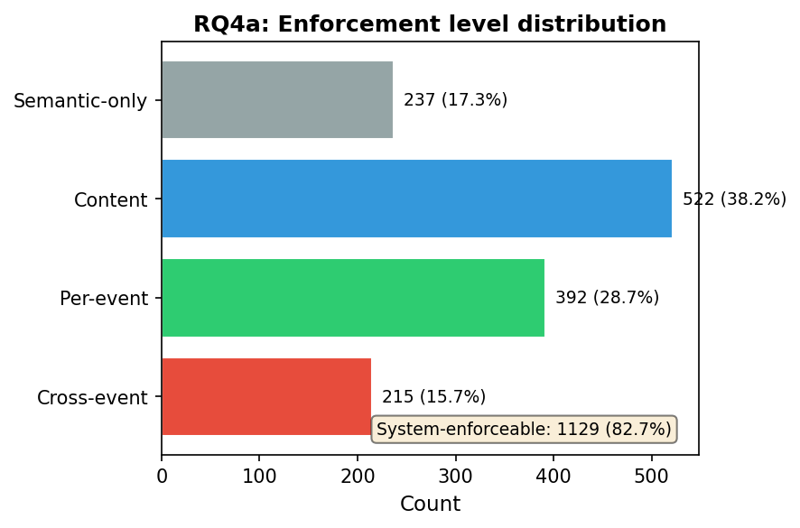
*Figure 7. Enforcement-level distribution across all 1,361 directives.
80.5% involve system-observable behavior.*
*(Script: `docs/tmp/fig_all_rqs.py`)*

**Takeaway.** The vast majority of instruction-file directives are not
"soft guidance" — they describe constraints on system-observable behavior
that a deterministic mechanism could, in principle, enforce. Only one in
five directives is fundamentally limited to model compliance.

#### 5.4.2 RQ4b: How does enforceability vary across topics?

Figure 8 shows the absolute enforceability breakdown by topic.
Development Process contributes the most cross-event directives (82),
followed by Testing (27) and Architecture (22). Implementation Details
is dominated by content-level directives (264 of 334, 79.0%).

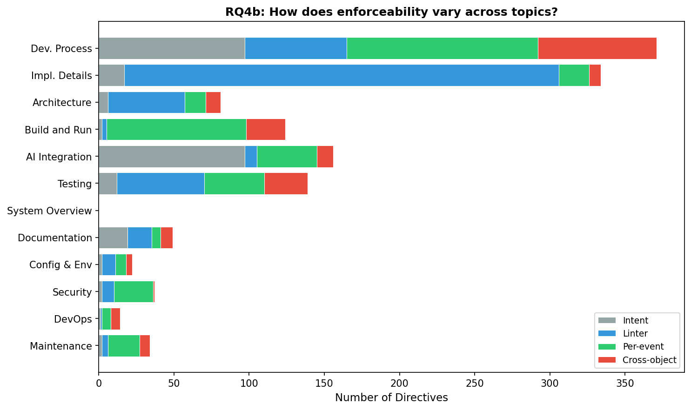
*Figure 8. Enforceability breakdown by topic (absolute counts).
Development Process has the most cross-event directives.*

#### 5.4.3 RQ4c: What is the enforceability profile of each topic?

Figure 9 normalizes each topic to 100%, revealing distinct profiles:

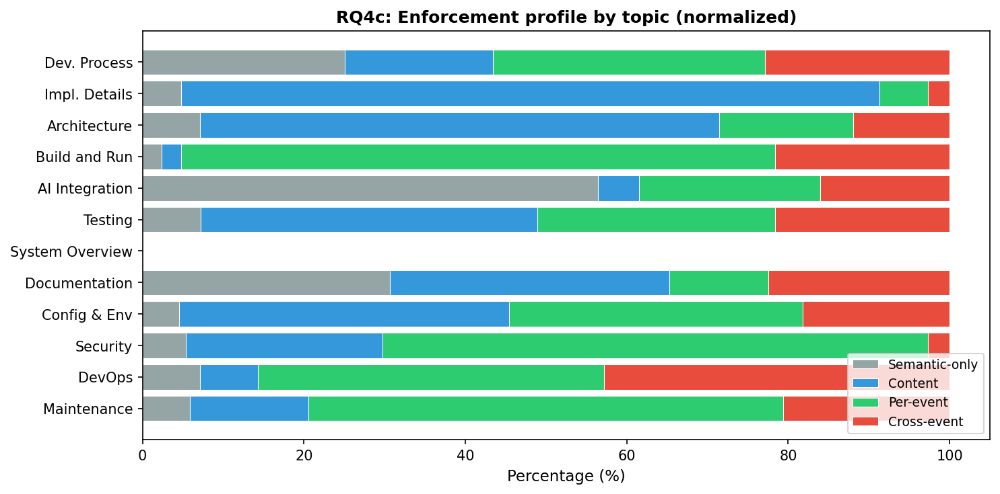
*Figure 9. Enforceability profile of each topic (normalized to 100%).
Topics cluster into four archetypes.*

Four archetypes emerge:

- **Content-dominant** (Implementation Details 79.0% content): coding
  style, naming conventions, type annotations. Enforcement requires
  parsing file content but not tracking state across operations.
- **Per-event-dominant** (Build and Run 62.1%, DevOps 57.1%): command
  constraints, file-path restrictions, tool-choice rules. Enforcement
  matches a single system call against a pattern.
- **Cross-event-heavy** (Development Process 22.1% cross-event,
  Testing 19.4%): ordering constraints ("run tests before committing"),
  cross-file consistency ("update docs when behavior changes"). These
  require an information-flow engine that tracks state across events.
- **Semantic-only-heavy** (AI Integration 36.5% semantic-only): agent
  routing, delegation strategy, tool preferences. These have no
  system-level enforcement path.

**Takeaway.** Enforceability is not a property of the directive alone —
it depends on the topic. The same file may contain content rules
(Implementation Details), per-event constraints (Build and Run), and
cross-event workflows (Development Process). A harness that supports
only one enforcement mechanism leaves significant gaps in the others.

#### 5.4.4 RQ4d: How much do successive enforcement layers cover?

Figure 10 shows the cumulative coverage as enforcement layers are added:

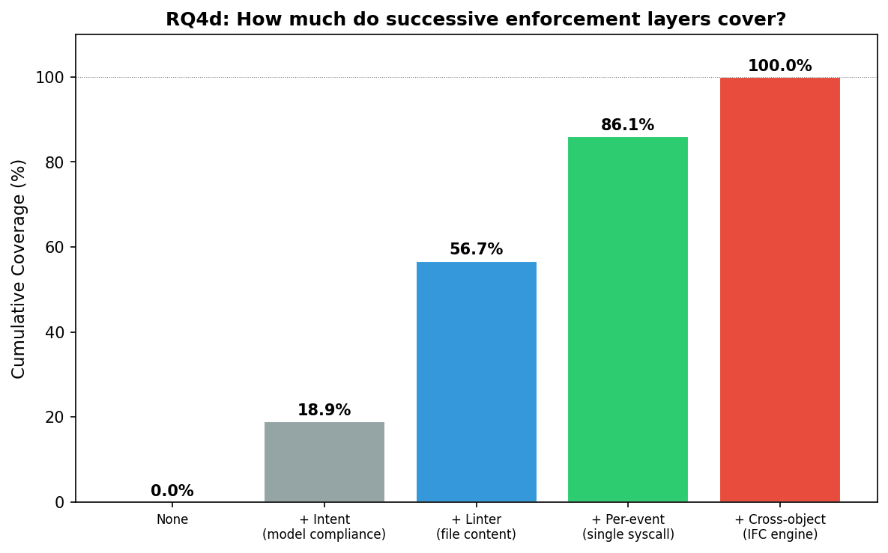
*Figure 10. Cumulative directive coverage by enforcement layer.
Linters alone cover 57.4%; adding per-event matching reaches 86.1%;
cross-event IFC closes the remaining 13.9%.*

| Layer | Cumulative | Marginal |
|---|---|---|
| None | 0% | — |
| + Semantic-only (model compliance) | 17.3% | 17.3% |
| + Content (file content inspection) | 55.6% | 38.2% |
| + Per-event (single-operation matching) | 84.3% | 28.7% |
| + Cross-event (IFC engine) | 100% | 15.7% |

**Takeaway.** Linter tools (the most widely deployed enforcement
mechanism for coding agents) cover only 55.6% of directives. Adding
per-event syscall matching (as provided by ActPlane's basic rules)
raises coverage to 84.3%. The remaining 15.7% — cross-event
directives requiring state across multiple operations — are exactly the
gap that labeled information-flow control addresses. No existing
deployed mechanism covers this layer.

#### 5.4.5 RQ4e: Where do cross-event directives concentrate?

The 215 cross-event directives are not uniformly distributed. Figure 11
shows their concentration by topic.

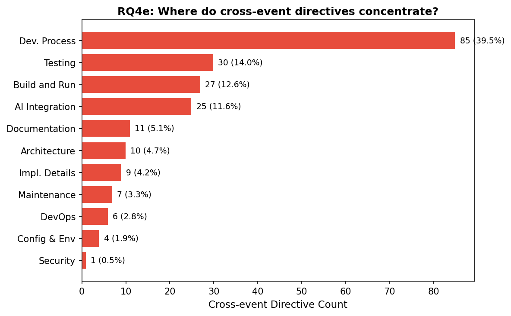
*Figure 11. Cross-object directives by topic. Development Process
accounts for 43.4% of all cross-event directives.*

Development Process alone accounts for 85 of 215 cross-event directives
(39.5%). Common patterns include:
- **Ordering**: "run tests before committing" (temporal gate)
- **Cross-file consistency**: "update docs when behavior changes"
  (multi-file tracking)
- **Multi-step workflows**: "12-step release checklist" (sequential
  procedure with verification)
- **Conditional updates**: "if you change specs, also update SDK and
  docs" (triggered cross-event)

These map directly to ActPlane's DSL constructs: `after` for temporal
gates, label propagation for cross-file tracking, and `since` for
staleness-aware re-arming.

#### 5.4.6 RQ4f: How do enforceability profiles vary across repos?

Figure 12 shows each repository's enforceability breakdown.

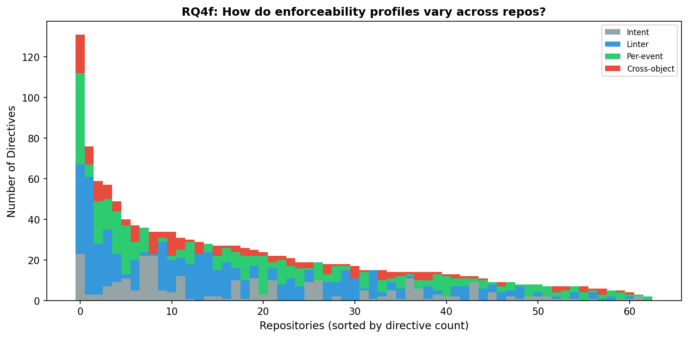
*Figure 12. Per-repository enforceability profile, sorted by directive
count. Each bar shows the mix of semantic-only (gray), content (blue),
per-event (green), and cross-event (red).*

At the repository level, 81% of projects (51/63) contain at least one
cross-event directive, 90% (57/63) need per-event enforcement, and
43% (27/63) require all four enforcement layers simultaneously.

#### 5.4.7 RQ4g: What fraction of repos need each enforcement layer?

Figure 13 shows the fraction of repositories that contain at least one
directive at each enforcement level.

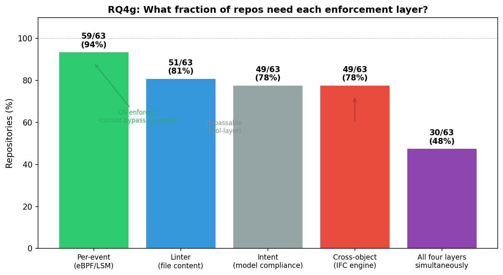
*Figure 13. Fraction of repos requiring each enforcement layer. 94%
need per-event (eBPF/LSM), 78% need cross-event (IFC engine), 48%
need all four layers simultaneously.*
*(Script: `docs/tmp/fig_all_rqs.py`)*

The enforcement layers differ not only in coverage but in **bypass
resistance**. Figure 14 shows the layered architecture:

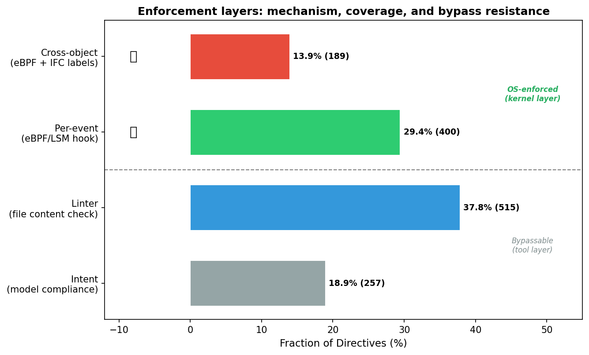
*Figure 14. Enforcement layers by mechanism, directive coverage, and
bypass resistance. The dashed line separates tool-layer mechanisms
(bypassable via direct syscall) from OS-enforced mechanisms (kernel
layer, cannot bypass).*

| Layer | Mechanism | Coverage | Bypassable? |
|---|---|---|---|
| Semantic-only | Model compliance | 19.5% | N/A (no enforcement) |
| Content | eBPF write hook + userspace linter | 37.9% | **No** (kernel intercepts write, triggers linter) |
| Per-event | eBPF/LSM hook | 28.7% | **No** (kernel intercepts every syscall) |
| Cross-event | eBPF + IFC label propagation | 13.9% | **No** (kernel tracks state across events) |

All three system-enforceable layers can be made un-bypassable by hooking
at the kernel level via eBPF/LSM. The key insight is that even content
enforcement — traditionally a tool-layer mechanism that agents can
bypass by writing files directly — becomes un-bypassable when the
kernel intercepts every `write` syscall and triggers a userspace linter
before the write completes. The three layers differ in complexity:

- **Content**: the kernel hooks `file_open(O_WRONLY)` and notifies a
  userspace linter daemon that inspects the written content (code style,
  naming, secret detection). The linter returns allow/deny.
- **Per-event**: the kernel matches a single syscall against a pattern
  (e.g., `block write file "vendor/**"` requires only a `file_open`
  hook with path matching). No userspace roundtrip needed.
- **Cross-event**: the kernel maintains label state across operations
  (e.g., `block exec "git" "commit" unless after exec "pytest"` tracks
  whether pytest ran in this session). Label propagation across
  fork/exec/read/write/connect.

**Takeaway.** Cross-event enforcement is not a niche requirement — it
affects 78% of repositories. Nearly half of all projects (48%) require
all four enforcement layers simultaneously. Repositories have distinct
enforcement profiles: code-style-heavy projects (openai/codex: 76.3%
content) differ sharply from workflow-heavy projects (openclaw: 36.6%
per-event, 14.5% cross-event). A one-size-fits-all enforcement approach
leaves systematic gaps; the right mechanism depends on the project's
directive mix.

### 5.5 RQ6: What context do system-level directives require?

#### 5.5.1 RQ6a: Overall context distribution

Of the 1,127 system-level directives, 297 (26.4%) are self-contained
(none), 724 (64.2%) require project context, and 106 (9.4%) require task
context. In total, 73.6% of system-level directives cannot be enforced
from the directive text alone — they require additional information
from the repository or the current session.

| Context | Count | % |
|---|---|---|
| None | 297 | 26.4% |
| Project | 724 | 64.2% |
| Task | 106 | 9.4% |

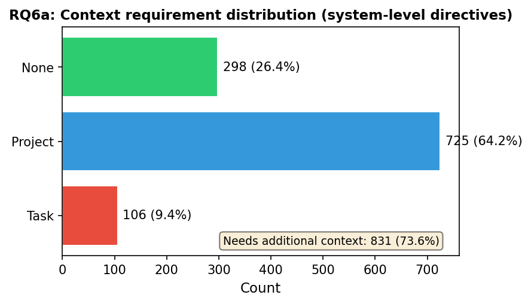
*Figure 15. Context requirement distribution across all 1,127
system-level directives. 73.6% need additional context to enforce.*
*(Script: `docs/tmp/fig_all_rqs.py`)*

#### 5.5.2 RQ6b: Context requirement by enforcement level

Context requirement varies sharply across enforcement levels:

| | None | Project | Task | Total |
|---|---|---|---|---|
| **Content** | 221 (42.5%) | 292 (56.2%) | 7 (1.3%) | 520 |
| **Per-event** | 66 (16.8%) | 267 (68.1%) | 59 (15.1%) | 392 |
| **Cross-event** | 10 (4.7%) | 165 (76.7%) | 40 (18.6%) | 215 |

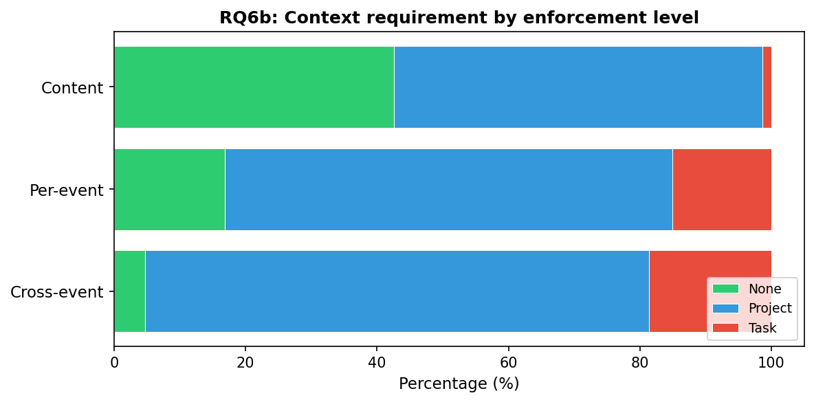
*Figure 16. Context requirement by enforcement level (normalized).
Cross-event directives are the most context-dependent (94.7% need
project or task context).*

Content directives are the most likely to be self-contained (42.5%
none) because coding style rules often spell out the exact pattern
("prefer `const` over `let`"). Cross-event directives are the most
context-dependent: 76.7% need project context and 18.6% need task
context, because temporal ordering and data-flow constraints almost
always reference project-specific tools and workflows ("run tests
before committing" — which test command?).

Task context concentrates in per-event directives (59/106 = 55.7%)
and cross-event directives (40/106 = 37.7%). Per-event task directives
are primarily approval gates ("do not commit without user approval"),
while cross-event task directives are primarily "read X before Y"
ordering constraints where the trigger is task-dependent.

#### 5.5.3 RQ6c: Context requirement by topic

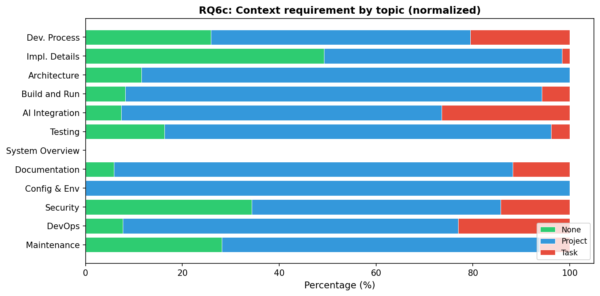
*Figure 17. Context requirement by topic (normalized).*

**Takeaway.** The majority of system-level directives (73.6%) are not
self-contained — they require the enforcement mechanism to read the
repository (64.2%) or know the current task (9.4%) before the directive
can be translated into a concrete rule. This quantifies the need for
an agent-programmable policy interface: the agent must read the repo
and understand the task to generate enforcement rules. Hardcoded rules
cover only 26.4% of system-level directives.

---

## 6. Discussion

### 6.1 Descriptions vs. Directives: A Missing Distinction

Prior studies classify instruction files by topic ("this file contains
Testing content") but do not distinguish descriptions from directives
within each topic. Our statement-level analysis reveals that this
distinction matters profoundly.

Consider the Testing topic: it contains 189 statements, but 50 are
descriptions ("the project uses Vitest") and 139 are directives ("run
all tests before committing"). These have fundamentally different
enforcement implications — the description requires no action, while
the directive requires temporal ordering across operations.

Architecture illustrates the opposite problem. It ranks third by
statement count (364) and first by line count (23.7%), which is why
prior file-level studies report it as the dominant topic. But 77.7% of
Architecture statements are descriptions (directory listings, data-flow
diagrams). The actual number of Architecture directives (81) is less
than half the number in Development Process (371) or Implementation
Details (334). File-level analysis cannot make this distinction.

### 6.2 The Cross-Object Enforcement Gap

The cumulative coverage curve (Figure 10) identifies a concrete
enforcement gap. Linter tools — the most widely deployed enforcement
mechanism for coding agents — cover 55.6% of directives. Adding
per-event syscall matching raises coverage to 84.3%. But 215 directives
(15.7%) require cross-event state tracking: knowing what files were
previously read, what commands previously ran, or whether a multi-file
update is consistent.

These cross-event directives are concentrated in Development Process
(43.4%) and involve four recurring patterns:

1. **Temporal ordering** (e.g., "run tests before committing"):
   enforcement requires a gate that checks whether a prior event
   occurred before the current one.
2. **Cross-file consistency** (e.g., "update docs when behavior
   changes"): enforcement requires tracking which files changed and
   verifying that dependent files were also updated.
3. **Multi-step workflows** (e.g., "12-step release checklist"):
   enforcement requires tracking progress through a sequence.
4. **Conditional triggers** (e.g., "if you change specs, also update
   SDK"): enforcement requires matching the trigger event and verifying
   the required follow-up.

No currently deployed agent enforcement mechanism covers this layer.
Tool-call guards (action-level) cannot see syscalls; linters cannot
track ordering; per-event matchers lack accumulated state. This gap is
the motivation for labeled information-flow control at the OS level.

### 6.3 Implications for Agent Harness Design

The enforceability profiles (Figure 9) suggest that an effective agent
harness must be layered:

- **Semantic-only layer** (17.3% of directives): irreducible — these
  depend on model compliance. Examples: "be concise", "explain your
  reasoning", "prefer the lightest-weight path." No deterministic
  mechanism can enforce these; the harness can only inject them as
  context.
- **Content layer** (38.2%): code style, naming, formatting, commit
  message structure. Existing tools (ruff, clippy, eslint, oxlint)
  already cover this; the harness contribution is ensuring they run.
- **Per-event layer** (28.7%): command restrictions, file-path
  constraints, tool-choice rules. Enforceable by matching a single
  syscall or tool call against a pattern. This is ActPlane's basic
  rule model.
- **Cross-event layer** (15.7%): ordering, consistency, workflow
  constraints. Requires label propagation across process/file/network
  boundaries. This is ActPlane's IFC engine.

The layered view explains why no single mechanism suffices. A project
with 70% content directives (e.g., openai/codex) benefits most from
content-inspection integration. A project with 22% cross-event directives (e.g.,
Development Process-heavy repos) needs an IFC engine. The harness must
compose mechanisms, not replace one with another.

### 6.4 Annotation Methodology and Validation

Statement extraction and Axis 1/2 classification were performed
manually by one author and cross-validated by an independent LLM agent review
pass (OpenAI Codex CLI with GPT-5.5), operating under an ActPlane write-fence policy
that restricted the reviewer to `docs/tmp/` output only (a worked
example of the system under study). Enforceability annotation (Axis 3)
was performed manually by one author, then independently reviewed by
both a Claude Opus 4.6 subagent and an OpenAI Codex CLI (GPT-5.5) agent,
each producing a written review document with specific per-statement
disagreements.

The Codex review identified four systematic patterns: (1) MCP/skill
tool-call directives systematically under-classified as semantic-only
instead of per-event/cross-event, (2) content-sensitive prohibitions
over-classified as per-event when content-level inspection is
required, (3) temporal ordering constraints under-recognized as
cross-event, and (4) compound workflow statements sometimes
over-compressed. Patterns (1) and (3) led to 51 reclassifications after
manual verification of each change. Patterns (2) and (4) were reviewed
and mostly rejected with documented reasoning (see
`docs/tmp/enforceability-review.md`).

The estimated annotation error rate after correction is 5--8% based on
independent review agreement.

---

## 7. Related Work

### 7.1 Empirical Studies of Agent Instruction Files

Five prior studies have examined agent instruction files. Chatlatanagulchai
et al. (2025a, 2025b) classified CLAUDE.md files by topic at file level,
identifying 15--16 categories with Build and Run as the most prevalent.
Santos et al. (2025) classified section headings in 328 CLAUDE.md files
into 9 categories. Lulla et al. (2026) measured the efficiency impact of
AGENTS.md (28.6% median runtime reduction). Liu et al. (2026) reverse-
engineered Claude Code and found CLAUDE.md is treated as context, not
policy. See Section 2.2 for detailed summaries.

All five studies share three limitations this work addresses: file-level
granularity (G1), topic-only taxonomy (G2), and no enforceability
assessment (G3). Our statement-level analysis with enforceability
annotation is the first to address all three.

### 7.2 Agent Harnesses and Guardrails

The agent harness concept (Agent = Model + Harness) frames the
infrastructure surrounding a model as a first-class engineering concern.
Several systems enforce behavioral policies on agents:

- **AgentSpec** compiles dataflow policies to tool-call-level guards.
  Our findings suggest this covers the per-event layer (28.7% of
  directives) but not the cross-event layer (13.9%) because tool-call
  interception cannot track accumulated state.
- **Invariant** enforces guardrails at the tool-call boundary with
  pre/post-condition checks. Similar coverage to AgentSpec.
- **CaMeL** uses capability-based security with information-flow
  tracking at the application layer. It addresses cross-event
  constraints but operates above the OS, leaving syscall-level bypasses
  possible.
- **FIDES** and **Progent** provide formal verification frameworks for
  agent policies but focus on specification, not runtime enforcement.

Our empirical data provides the first quantitative basis for evaluating
these systems: which fraction of real-world directives falls within each
system's enforcement scope.

### 7.3 Information-Flow Control and OS Enforcement

Labeled information-flow control (IFC) tracks data provenance across
system objects. In-kernel IFC systems include:

- **CamQuery** (CCS 2018): propagates confidentiality labels across
  process/file/network in-kernel via Linux Provenance Modules. It
  demonstrates that cross-event label tracking is feasible in-kernel
  but uses a kernel module (not eBPF) and targets security auditing,
  not agent enforcement.
- **CamFlow**: whole-system provenance capture with label propagation.
  Detect-only; no enforcement.
- **Tetragon**: eBPF-based runtime enforcement with process lineage
  tracking. Supports single-channel blocking but lacks the multi-label
  boolean logic needed for cross-event agent constraints.
- **SLEUTH/SPADE**: provenance-based intrusion detection. Detect-only.

Our cross-event directives (13.9%) map to IFC primitives: temporal
ordering maps to lineage gates, cross-file consistency maps to label
propagation, and conditional triggers map to taint-and-check patterns.
This empirical mapping validates the design space that systems like
ActPlane target.

---

## 8. Threats to Validity

### 8.1 Construct Validity

- The desc/directive distinction and directive subtypes are defined by the
  authors. Alternative taxonomies are possible. The Axis 1 split draws on
  speech-act theory (constative vs. directive) but we do not claim
  linguistic completeness.
- Enforceability is assessed via the decision procedure in Section 4.4,
  not by empirical testing against deployed enforcement systems. The
  assessment reflects the authors' understanding of existing mechanisms.
- LLM-agent-assisted classification introduces model-specific bias.
  Different LLM agents may segment and classify differently; no
  sensitivity analysis across models is performed.
- **Researcher bias.** The authors also develop an OS-level enforcement
  system (ActPlane). The taxonomy and enforceability criteria may be
  unintentionally skewed toward enforceable directives. We mitigate this
  through the decision procedure (Section 4.4) and annotation validation
  (Section 4.6), but acknowledge the risk.

### 8.2 Internal Validity

- Annotation validation is based on independent LLM cross-review, not
  formal inter-rater agreement. Estimated error rate is 5–8%.
- Statement extraction depends on markdown parsing heuristics; malformed
  files may lose statements.

### 8.3 External Validity

- Star-based sampling biases toward well-maintained, popular projects.
  Instruction files in less popular or private repositories may differ.
- Only two file types (CLAUDE.md, AGENTS.md)
  are included. Other agent configuration mechanisms (settings files, MCP
  configs, system prompts) are excluded.
- Single-time-point snapshot. Instruction files evolve rapidly
  (Chatlatanagulchai et al. report median 1--3 day update intervals).
- English-language bias. Non-English instruction files are excluded.

---

## 9. Conclusion

This paper presents the first statement-level analysis of agent
instruction files, extracting 2,116 statements from 64 repositories and
classifying each along four axes: content type, topic, enforcement
level, and context requirement.

**RQ1 (Content types).** 64.3% of statements are directives by count,
but only 48.6% by line count, because directives are terse (3.6
lines/statement) while descriptions are verbose (7.0 lines/statement).
Prior line-level or file-level analyses see a balanced document;
statement-level analysis reveals a 2:1 directive majority.

**RQ2 (Topic distribution).** Development Process (19.9%), Implementation
Details (18.3%), and Architecture (16.9%) dominate. But Architecture is
77.7% description — prior studies that rank it first by file prevalence
overstate its directive content. Statement-level analysis corrects this
distortion.

**RQ3 (Directive density).** Directives per repo range from 0 to 131
(median 15). The top 10 repos account for 40.6% of all directives,
indicating a right-skewed distribution.

**RQ4 (Enforcement level).** 82.8% of directives involve system-observable
behavior. Content-level enforcement covers 38.2%, per-event matching
covers an additional 28.8%, and the remaining 15.8% require cross-event
state tracking. Although 15.7% sounds modest at the directive level,
81% of repositories contain at least one such directive, and 43% require
all four enforcement layers simultaneously. This cross-event gap —
concentrated in Development Process (ordering constraints, cross-file
consistency) — is the enforcement gap that no currently deployed
mechanism addresses.

**RQ6 (Context requirement).** 72.8% of system-level directives are
not self-contained — they require the agent to read the repository
(65.5%) or know the current task (7.3%) before the directive can be
translated into a concrete enforcement rule. Cross-event directives
are the most context-dependent (94.7% need project or task context).
Task context concentrates in per-event approval gates (72.5% of task
directives). This quantifies the need for an agent-programmable policy
interface: hardcoded rules cover only 27.2% of system-level directives.

The annotated dataset (2,116 statements, 64 repositories, four-axis
classification) is released as a public replication package. We hope it
provides a quantitative foundation for agent harness engineering: not
just what topics developers address in instruction files, but what
specific rules they write, which enforcement mechanisms each rule
requires, and what context must be supplied to make each rule
enforceable.

---

## Appendix A: Detailed Methodology Comparison with Prior Studies

| Dimension | Chatlatanagulchai (2025a) | Chatlatanagulchai (2025b) | Santos (2025) | Lulla (2026) | Liu (2026) | **This study** |
|---|---|---|---|---|---|---|
| **Files** | CLAUDE.md | CLAUDE.md, AGENTS.md, copilot-instructions.md | CLAUDE.md | AGENTS.md | Claude Code internals | CLAUDE.md, AGENTS.md |
| **Corpus** | 253 files / 242 repos | 2,303 files | 328 files / 100 repos | 10 repos / 124 PRs | 1 tool (Claude Code) | 84 files / 64 repos |
| **Unit** | File | File | Section heading | PR | — | **Statement** |
| **Taxonomy** | 15 topics | 16 topics | 9 SE concerns | — | — | **12 topics + desc/dir + enforceability + context req.** |
| **Classification** | 2 coders + tie-breaker | 2 coders (80.3% agree) + GPT-5 | 1 coder + meeting | — | — | **1 coder + LLM agent cross-validation + independent review** |
| **Reliability** | 9.2% disagree (no kappa) | 80.3% raw (no kappa) | None (meeting) | — | — | **Independent Codex + Claude review, 5-8% estimated error** |
| **Enforceability** | No | No | No | No | No | **Yes (4-level decision procedure)** |
| **Granularity** | File | File | Section title | PR | — | **Statement (line-range, verbatim text)** |
