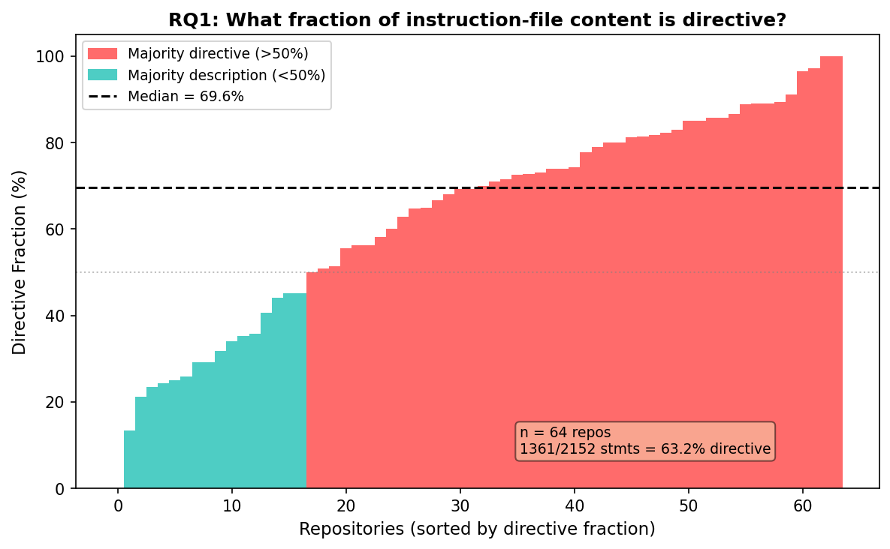
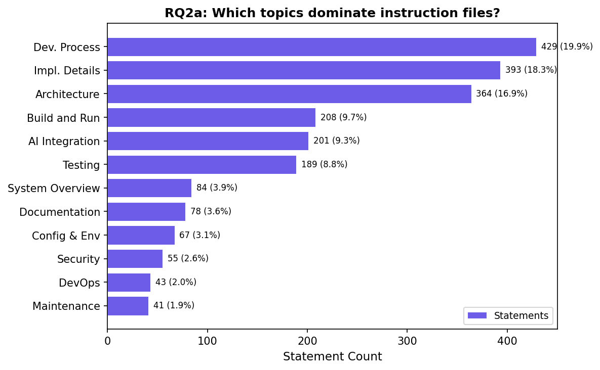
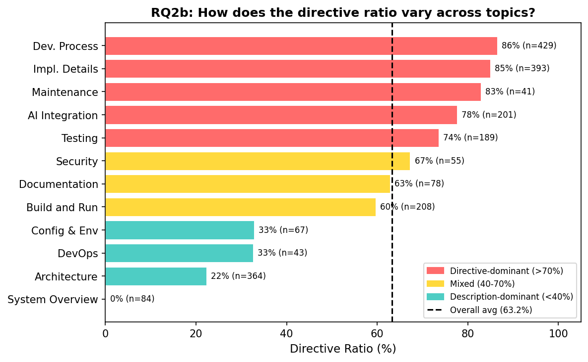
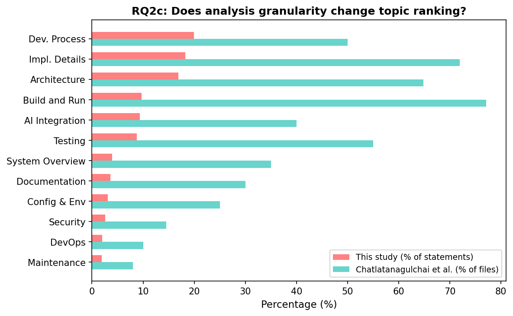
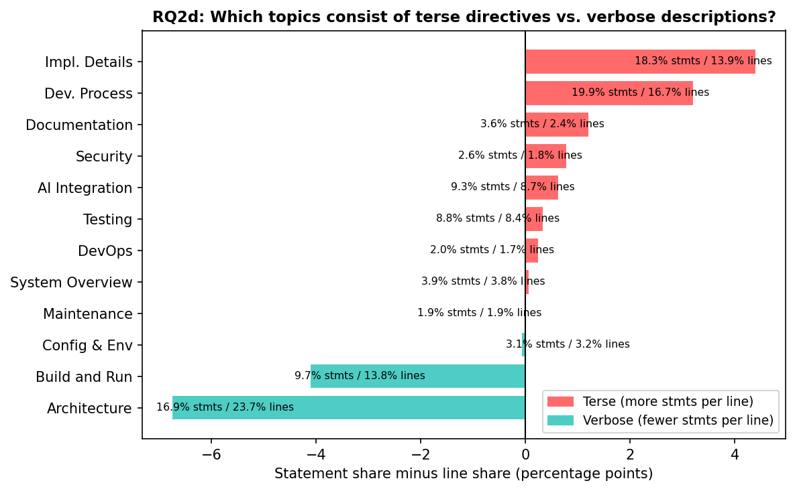
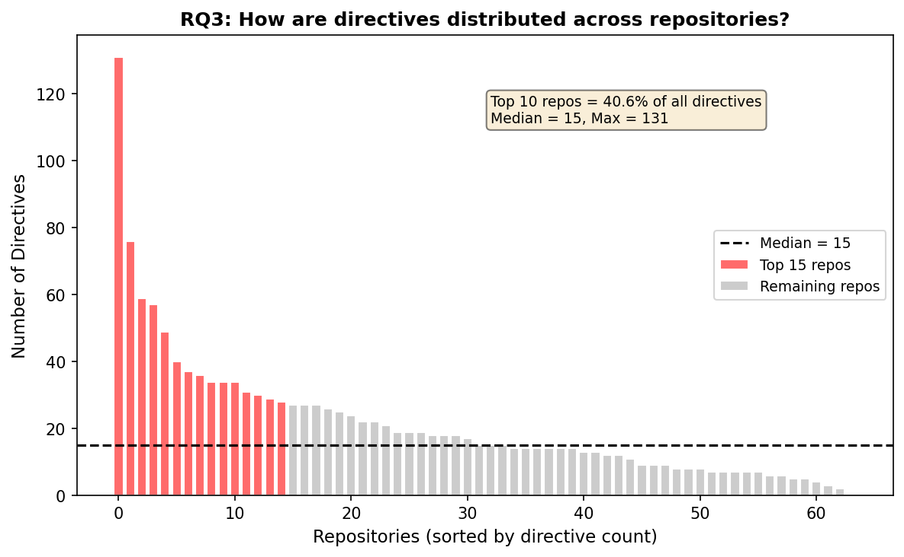

# What Do Developers Tell Their Agents? A Statement-Level Analysis of Agent Instruction Files

## Abstract

AI coding agents are increasingly governed by natural-language instruction
files (CLAUDE.md, AGENTS.md). Prior empirical
studies classify these files by topic (Architecture, Testing, Security) at
file or section granularity, but do not distinguish descriptions from
directives, do not extract individual rules, and do not assess
enforceability. This paper presents the first statement-level analysis of
agent instruction files. We extract individual statements from instruction
files in N popular open-source projects, classify each statement along two
axes (description vs. directive; directive subtype), and assess the
enforceability of each directive using the intent/action/behavior
framework: can the directive be enforced at the intent level (the agent's
own compliance), the action level (tool-call interception), or the
behavior level (OS-level observation of system calls and their
provenance)? We find that
(TODO: headline findings). Our taxonomy and annotated dataset provide a
foundation for future work on agent compliance measurement and
enforcement system design.

---

## 1. Introduction

AI coding agents such as Claude Code, OpenAI Codex CLI, and GitHub Copilot
Workspace operate as autonomous processes with access to shells, file
systems, package managers, and network services. To guide agent behavior,
project maintainers write natural-language instruction files that are
injected into the agent's context at the start of each session. These files
have rapidly become a standard practice: Chatlatanagulchai et al. report
that 59--67% of instruction files are modified in multiple commits, with
median update intervals of 1--3 days.

Five prior empirical studies have characterized these files along dimensions
of content taxonomy, structural properties, maintenance practices, and
efficiency impact (see Section 7). However, all prior studies classify at
file level or section-heading level, asking "what topics does this file
cover?" None extracts individual rules, distinguishes descriptions from
directives, or assesses whether individual rules are machine-enforceable.

This gap matters because the emerging field of agent harness
engineering---the practice of building infrastructure to make agents
reliable---requires knowing not just what topics developers address but
what specific rules they write, how those rules distribute across projects,
and which rules can be enforced by deterministic mechanisms at different
layers of the system stack.

This paper addresses this gap with a statement-level analysis of agent
instruction files. We make three contributions:

1. A **statement-level taxonomy** that classifies individual statements
   extracted from instruction files along two axes: content type
   (description vs. directive) and directive subtype (style, build,
   constraint, communication).

2. A **statement-level corpus** of N statements extracted from instruction
   files in M projects, annotated along the taxonomy and released as a
   public dataset.

3. An **enforceability analysis** using the intent/action/behavior
   framework that assesses each directive at three levels (intent, action,
   behavior), identifying the subset that requires cross-object state
   tracking at the behavior level and cannot be enforced at the action
   level alone.

---

## 2. Background and Related Work

### 2.1 Agent Instruction Files

Agent instruction files are project-specific natural-language documents
that configure agent behavior. This study focuses on the two formats used
by coding agents with full tool access (shell, file system, network):

- **CLAUDE.md**: used by Claude Code (Anthropic). Loaded from the project
  root and parent directories; treated as context injected into the agent's
  system prompt.
- **AGENTS.md**: used by OpenAI Codex CLI. Similar role and structure.

We exclude copilot-instructions.md (GitHub Copilot) because Copilot
Workspace operates with more constrained tool access, making the
intent-behavior gap less relevant. These files have no formal schema.
Their content ranges from one-line directives ("never push to main") to
multi-page documents covering architecture, build instructions, testing
procedures, and coding standards.

### 2.2 Prior Empirical Studies

Five studies have examined agent instruction files empirically. We
summarize each below; a detailed methodology comparison is in Appendix A.

**Chatlatanagulchai et al. (2025a)** collected 253 CLAUDE.md files from 242
repositories and classified them into 15 topic categories at file
granularity. Two inspectors assigned labels per file (no Cohen's kappa
reported; 9.2% disagreement rate resolved by a third inspector). Top
categories: Build and Run (77.1%), Implementation Details (71.9%),
Architecture (64.8%), Security (8.7%).

**Chatlatanagulchai et al. (2025b)** expanded to 2,303 files across three
tools (Claude, Codex, Copilot). Manual labeling of a 332-file subset
(80.3% raw agreement, no kappa), followed by GPT-5 automated
classification of the full corpus (micro-avg F1 = 0.79). 16 topic
categories; Security 14.5%. The authors note examples of prohibitive
instructions but do not quantify their prevalence.

**Santos et al. (2025)** analyzed 328 CLAUDE.md files from top-100
repositories. Classification at section-heading level by a single author,
verified by two others in a meeting (no reliability metric). 9 SE concern
categories; Software Architecture (72.6%).

**Lulla et al. (2026)** measured the efficiency impact of AGENTS.md files
on 10 repositories / 124 PRs. AGENTS.md reduced median runtime by 28.64%
and output tokens by 16.58%. Compliance was explicitly not measured.

**Liu et al. (2026)** reverse-engineered Claude Code v2.1.88 and found that
CLAUDE.md is treated as context, not policy: there are no hard deny/allow
gates for CLAUDE.md directives. The paper cites Anthropic's internal data
showing a 93% permission-prompt approval rate (not independently verified).

### 2.3 Gaps in Prior Work

All prior corpus studies share three limitations that this study addresses:

**G1: File-level granularity.** Classification is applied to whole files or
section headings. No study extracts individual statements or counts
directives per file. A file classified as "Testing" may contain 1 testing rule or 20; the
studies cannot distinguish these cases.

**G2: Topic-based taxonomy.** Categories describe what a file is *about*
(Architecture, Security, Testing), not what it *demands* (describe,
instruct, constrain). A behavioral constraint like "run tests before
committing" falls under "Testing" alongside non-constraining content like
"the project uses Jest." The studies cannot separate the two.

**G3: No enforceability assessment.** No study asks whether a rule can be
enforced by a deterministic mechanism, or at which layer of the system
stack enforcement is possible.

---

## 3. Research Questions

We pose five research questions, organized from descriptive to analytical.

**RQ1 (Content types): What fraction of instruction-file content is
description vs. directive?**
Prior studies classify by topic but do not distinguish factual descriptions
("this project uses React") from directives ("always use TypeScript for new
files"). RQ1 establishes the base rate of directive content.

**RQ2 (Topic distribution): How do descriptions and directives distribute
across topic categories?**
We apply Chatlatanagulchai et al.'s 16 topic categories at statement level
and cross-tabulate with the description/directive distinction from RQ1.
This reveals how directives are distributed across topics that prior
studies report only at file level.

**RQ3 (Directive density): How many directives does each project contain,
and how are they distributed?**
Prior studies report file-level prevalence ("77% of files contain Build/Run
content") but not directive counts. RQ3 measures the number of directives
per project, enabling distribution analysis (median, mean, skewness).

**RQ4 (Enforceability): Which directives are enforceable, and at what
level?**
Following the intent/action/behavior framework, we assess each directive
at three levels:
- **Intent**: the directive can only be followed if the LLM retains it in
  context and complies probabilistically.
- **Action**: the directive can be checked deterministically by inspecting
  tool-call names and arguments at the agent-framework boundary.
- **Behavior**: the directive can be checked by observing OS-level
  operations (system calls) and their provenance across the process tree.
Within behavior-level directives, we further distinguish *per-event*
(checkable from a single system call) from *cross-object* (requiring
state accumulated across multiple events and objects).

**RQ5 (Enforcement requirements): What enforcement mechanisms do different
directive types require?**
For each directive subtype, we characterize the minimum enforcement level
required and the fraction that requires cross-object state tracking. This
enables a layered view of which directives are addressable by existing
mechanisms and which require mechanisms not yet deployed in practice.

---

## 4. Methodology

### 4.1 Dataset Construction

**Sampling frame.** We target public GitHub repositories that contain at
least one agent instruction file (CLAUDE.md or AGENTS.md) in a standard
location (repository root or `.claude/` directory).

**Search strategy.** We search for repositories in the AI agent ecosystem
via GitHub topic and keyword queries (e.g., `topic:ai-agent`,
`topic:coding-agent`, `topic:llm-agent`, `topic:mcp`) rather than
searching for CLAUDE.md files by filename. This targets projects whose
developers actively use coding agents in their development workflow,
producing more mature and substantive instruction files. A direct filename
search (as used by Chatlatanagulchai et al.) would include repositories
where CLAUDE.md was added experimentally or contains minimal content.
The full list of 15 search queries is recorded in the replication package
(`queries.log`).

**Filtering.** From the search results, we apply five exclusion criteria:

1. **Non-code repositories.** Repositories whose primary language is
   null or Markdown, or whose name/topics match documentation patterns
   (awesome-lists, tutorials, prompt collections, skill catalogs).
2. **Fake-star filtering.** The AI agent ecosystem has significant
   star inflation. We exclude repositories where forks > 0.8 x stars
   (fork-bot signal), stars > 40k with open issues < 20 (no community),
   or age < 2 months with stars > 40k (implausible growth). A manual
   blocklist covers confirmed fake/SEO repositories.
3. **Recency.** Repositories created before 2025 are excluded. Coding
   agents with full tool access (Claude Code, Codex CLI) became widely
   available in 2025; repositories created earlier may have added
   instruction files retroactively rather than as part of an
   agent-native development workflow.
4. **Activity.** Repositories with no push activity within 2 weeks of the
   snapshot date are excluded, ensuring the corpus reflects projects
   under active development with agents.
5. **Trivial content.** Instruction files smaller than 500 bytes (pointer
   files, empty stubs) are excluded at the repository level (a repository
   is excluded only if all its instruction files are < 500 bytes; a
   repository with one pointer file and one substantive file is retained).
   Where CLAUDE.md and AGENTS.md are byte-identical, the duplicate is
   counted once.

Critically, we do **not** exclude repositories based on whether they
contain behavioral directives. Repositories with zero directives (all
descriptions) remain in the corpus as honest data points in the
denominator.

All exclusions are logged with reasons (`exclusions.log`) for
reproducibility.

**Snapshot.** All files were collected on 2026-05-23 (UTC). Repository
metadata (stars, primary language, creation date, last push date) was
recorded at collection time.

**Corpus statistics.**

| Statistic | Value |
|---|---|
| Repositories | 64 |
| Instruction files (after dedup) | 84 |
| Total lines | 16,256 |
| Total bytes | 1,136,161 |
| Median file size | 7,052 bytes |
| Mean file size | 13,525 bytes |
| Star range | 9,772 -- 374,052 |
| Primary languages | TypeScript (25), Python (21), Rust (8), Go (5), other (5) |

### 4.2 Statement Extraction and Classification

**Definition.** A *statement* is a coherent unit of content in an
instruction file that expresses a single thought: one factual claim, one
directive, or one constraint. Statements may span one or more lines and
do not necessarily align with markdown structure (a single list item may
contain multiple statements; a statement may span a paragraph).

**Why not automated segmentation.** Mechanical splitting by markdown
structure (list items, paragraphs, sentences) produces poor results:
instruction files vary widely in formatting; a single list item may
contain multiple directives ("never commit secrets or push to main");
and context is often interleaved with directives in the same paragraph.
We therefore use LLM-based extraction, which identifies semantic
boundaries rather than syntactic ones.

**Extraction method.** We use a two-pass LLM pipeline. Both passes use
model [TODO] with temperature 0 and a fixed random seed for
reproducibility. The full prompts are included in the replication package.

**Pass 1: Extraction + classification.** The LLM reads the complete
instruction file and outputs a structured YAML document. Each extracted
statement is classified along both taxonomy axes and assessed for
enforceability. The output schema:

```yaml
file: "owner/repo/CLAUDE.md"
statements:
  - id: 1
    lines: [1, 4]             # half-open line range [start, end), includes header + blank line
    text: "# Project CLAUDE.md\n\nThe backend uses Express with TypeScript."
    type: description          # description | directive
    topic: Architecture        # 16 categories from Chatlatanagulchai et al.
    # fields below apply only to directives:
    enforceability: null       # intent | behavior_linter | behavior_per_event | behavior_cross_object
    confidence: null           # high | medium | low

  - id: 2
    lines: [15, 16]
    text: "Run the full test suite before committing."
    type: directive
    topic: Testing
    enforceability: behavior_cross_object
    confidence: high

  - id: 3
    lines: [22, 25]           # multi-line statement
    text: "Never commit secrets or credentials. Use environment variables for all sensitive configuration."
    type: directive
    topic: Security
    enforceability: behavior_cross_object
    confidence: high

  - id: 4
    lines: [30, 31]
    text: "Prefer const over let."
    type: directive
    topic: Implementation Details
    enforceability: intent
    confidence: high
```

The `lines` field records the half-open line range `[start, end)` in the
original file (1-indexed). The union of all line ranges for a file covers
lines 1 through N (total line count) with no gaps or overlaps, ensuring
every line is assigned to exactly one statement. The `text` field
preserves the original file content verbatim, including any headers,
blank lines, or formatting that fall within the line range.

**YAML formatting rules.** The `text` field uses YAML block scalar (`|`)
syntax. The text content must exactly match the source file lines for the
specified range. Quoted strings with `\n` escapes are not used.
Automated scripts must not be used to fill the `text` field; all
annotation is manual to ensure the annotator has read and classified each
statement. A validation script (`validate.py`) checks line-range
coverage (no gaps, no overlaps) and text fidelity (content matches source
after stripping whitespace) for every `statements.yaml` file.

**Granularity rules.**

- *Default: one line, one statement.* When source lines are
  independently meaningful (e.g., list items, standalone sentences),
  each line is a separate statement by default. Lines are merged into
  a single statement only when they form a single coherent thought that
  cannot be meaningfully split: a sentence continued across lines, a
  code block with its introductory text, a describtive list of files
  or a multi-line directive that
  expresses one constraint. The burden of proof is on merging, not on
  splitting. In particular, a list of directives under a shared section
  header (e.g., "Style Guide / General Principles") produces one
  statement per list item, not one statement for the entire section.
- *Minimum unit is a line.* Each line belongs to exactly one statement;
  no sub-line splitting is performed. When a line contains multiple
  directives with different topics (e.g., "Never commit secrets or push
  to main directly"), the broader topic is assigned.
- *Formatting is absorbed, not standalone.* Headers, blank lines,
  horizontal rules, HTML comments, and decorative elements (ASCII art
  boxes, emoji markers) belong to the statement they introduce or
  accompany. A section header belongs to the next statement; trailing
  blank lines belong to the preceding statement.
- *Semantically coherent blocks are one statement.* A list or table that
  expresses a single thought (e.g., a file-structure listing, a
  dependency list, a command reference table) is one statement spanning
  all its lines, not one statement per line. If rows in a table have
  different types (some description, some directive), each group of
  same-type rows is a separate statement. This rule applies only to
  descriptive enumerations (directory listings, dependency tables); it
  does not override the default split for independent directives.
- *Code blocks belong to their surrounding statement.* A code block
  that illustrates a directive (e.g., build commands following "Run
  these commands:") is part of that directive. A standalone code block
  (e.g., a file tree) is part of a description.
- *Compound directives with the same topic stay together.* "Never log,
  commit, or expose API keys" is one directive (topic: Security), not
  three. This applies only when a single sentence expresses multiple
  related constraints; separate list items are separate statements even
  if they share the same topic.
- *Lists of independent directives remain separate.* A list where each
  item is a self-contained directive (e.g., "Do not create git stash /
  Do not switch branches / Do not modify worktrees") produces one
  statement per item, because each has independent enforceability.
  This is the common case for markdown list items under a section
  header; merging list items into one statement requires explicit
  justification (e.g., they jointly define a single workflow step).
- *External references are directives.* Lines that point the agent to
  another file ("See AGENT\_INSTRUCTIONS.md for full instructions") are
  directives. The referenced file's content is not analyzed, but the
  reference itself is a statement.
- *Changelogs and version history are descriptions.* Changelog blocks
  are one description statement spanning the entire block. The prompt instructs the LLM to: (a) extract every distinct
statement with its line range, (b) classify each using the taxonomy
(Axis 1: type, Axis 2: topic, Axis 3: enforceability) following the
definitions in Sections 4.3 and 4.4, (c) assign a confidence level, and
(d) preserve the original text verbatim.

**Pass 2: Cross-validation.** A second LLM call reads the original file
together with the Pass 1 YAML and directly updates it: adding missed
statements, removing false extractions, and correcting classifications.
Each change is annotated with a `_review` field for auditability:

```yaml
file: "owner/repo/CLAUDE.md"
_review:
  pass1_count: 47
  added: 1
  removed: 1
  modified: 1
statements:
  - id: 2
    lines: [15, 16]
    text: "Run the full test suite before committing."
    type: directive
    topic: Testing
    enforceability: behavior_cross_object
    confidence: high

  # added by Pass 2 (was merged into id 14 in Pass 1)
  - id: 48
    lines: [67, 70]
    text: "Treat external input as untrusted."
    type: directive
    topic: Security
    enforceability: behavior_cross_object
    confidence: medium
    _review: "added: missed by Pass 1, embedded in security paragraph"

  # modified by Pass 2
  - id: 7
    lines: [28, 29]
    text: "Always run linter before pushing."
    type: directive
    topic: Development Process  # was: Implementation Details
    enforceability: behavior_cross_object
    confidence: medium
    _review: "modified topic: Implementation Details -> Development Process"

  # id 12 removed by Pass 2 (was a code example, not a statement)
```

The `_review` metadata block records Pass 2 statistics; per-statement
`_review` fields record individual changes. Statements without a
`_review` field were unchanged from Pass 1.

**Methodological metrics from the two-pass pipeline.** For the full
corpus, we report:
- Pass 2 addition rate: fraction of statements missed by Pass 1
  (estimates extraction recall).
- Pass 2 removal rate: fraction of Pass 1 extractions rejected
  (estimates extraction precision).
- Pass 2 modification rate: fraction of classifications changed
  (estimates classification stability).

**Manual validation.** A stratified random sample of [TODO: N] statements
(stratified by LLM-assigned type and subtype) is independently coded by
two human annotators using the same taxonomy. We report Cohen's kappa for
Axis 1 (description vs. directive), Axis 2 (topic category), and
Axis 3 (enforceability level). Disagreements are resolved by discussion; the
resolution and rationale are recorded.

### 4.3 Taxonomy

Each statement is classified along three dimensions.

**Axis 1: Content type** (speech-act distinction, following Searle 1976).

| Type | Definition | Example |
|---|---|---|
| **Description** | Factual statement about the project. Does not instruct the agent to do or avoid anything. | "The backend uses Express with TypeScript." |
| **Directive** | Statement that instructs the agent to perform, avoid, or condition an action. | "Run tests before committing." |

There is no separate "structural" category. Formatting elements (headers,
blank lines, horizontal rules, HTML comments, decorative ASCII art) are
absorbed into the statement they introduce or accompany. A section header
like `## Testing` belongs to the next statement. Blank lines between
statements belong to the preceding statement. This ensures every line is
classified as part of a description or directive without a third category.

**Decision procedure.** If the statement (ignoring formatting) can be
rephrased as an imperative ("do X", "do not do X", "do X before Y"), it
is a directive. Otherwise it is a description.

**Axis 2: Topic category** (adapted from Chatlatanagulchai et al. 2025b).

We start from the 16-category topic scheme of Chatlatanagulchai et al.
(2025b) and collapse four sparse categories (each n < 30 at
statement level) into their closest parent, yielding 12 analysis
categories: Debugging and Project Management are merged into Development
Process; Performance and UI/UX are merged into Implementation Details.
The resulting 12 categories are: System Overview, AI Integration,
Documentation, Architecture, Implementation Details, Build and Run,
Testing, Configuration & Environment, DevOps, Development Process,
Maintenance, Security. Definitions follow Chatlatanagulchai et al.
(2025b); the full coding guide is in the replication package.

Prior studies applied these categories at file level ("this file contains
Testing content"). We apply them at statement level ("this statement is
about Testing"). This enables cross-tabulation: for each topic category,
what fraction of statements are descriptions vs. directives? This
directly answers how behavioral directives are distributed across the
topic categories that prior studies report.

**Axis 3: Enforceability** (new, applied only to directives).

Each directive is classified by the type of mechanism required to enforce
it. The key distinction is between directives related to the agent's
observable system behavior (any interaction with files, commands, or
network) and directives that exist purely at the conversation level.

| Level | Definition | Example |
|---|---|---|
| **Intent** | Directive governs only the agent's communication, reasoning strategy, or output presentation. No system-level observable counterpart. | "Always explain your reasoning." / "Be concise." / "Report the full URL at end of task." |
| **Behavior (linter)** | Directive imposes requirements on the *content* of files the agent reads or writes. Enforcement requires inspecting file content, not just the file-access event itself. | "Prefer `const` over `let`." / "Use type hints." / "Commit format: `type(scope): message`." |
| **Behavior (per-event)** | Directive can be checked by matching a single system operation (command execution, file access, network connection) against a pattern. An agent reading the repository context can determine the concrete pattern. | "Do not run `rm -rf`." / "Never push to main." / "Do not create git worktree." / "Never modify vendor/ files." |
| **Behavior (cross-object)** | Directive requires state accumulated across multiple system operations and objects. | "A process that read `.env` must not connect to external endpoints." / "Run tests before committing." / "Only modify DB through the migration tool." |

### 4.4 Enforceability Assessment

For each directive, we assess enforceability using the following decision
procedure.

**Step 1: Does the directive relate to any system-level behavior?**
A directive relates to system-level behavior if it concerns commands
executed, files accessed or modified, network connections, or process
lifecycle. Even if stated abstractly (e.g., "never modify upstream
source"), it is system-level if an agent reading the repository context
can map it to concrete system operations (e.g., "upstream" = files in
`vendor/` directory). If the directive relates ONLY to the agent's
conversation with the user (tone, explanation, reporting format), it is
**intent**.

**Step 2 (for system-level directives): Does enforcement require
inspecting file content?** If the directive imposes requirements on the
text content of files the agent reads or writes (code style, formatting,
naming conventions, commit message format), it is **behavior (linter)**.
The distinguishing feature: enforcement requires reading the file and
parsing its content, not just observing the file-access system call.

**Step 3: Can violation be detected from a single system operation?**
If the directive can be checked by matching one command execution, one
file access, or one network connection against a pattern derivable from
the repository context, it is **behavior (per-event)**. Examples:
matching `execve("git", ["worktree", ...])`, matching `open("vendor/...")`,
matching `connect(external_ip)`.

**Step 4: Does detection require state across multiple operations?**
If checking the directive requires knowing what happened before the
current operation (which files were previously read, which commands
previously ran, the process lineage), it is **behavior (cross-object)**.

This procedure assigns each directive to exactly one level.
Enforceability is included in the inter-rater reliability assessment
(Section 4.6).

### 4.5 Worked Examples

The following examples illustrate the full annotation pipeline from raw
text to final labels.

| Raw text | Axis 1 | Axis 2 (Topic) | Axis 3 (Enforceability) | Rationale |
|---|---|---|---|---|
| "The backend uses Express with TypeScript." | Description | Architecture | — | Factual; no imperative. |
| "Always explain your reasoning before making changes." | Directive | AI Integration | Intent | Purely agent-user communication. |
| "Be concise in responses." | Directive | AI Integration | Intent | Purely output style. |
| "Report the full URL at end of task." | Directive | AI Integration | Intent | Purely output format. |
| "Prefer `const` over `let`." | Directive | Implementation Details | Behavior (linter) | Requires inspecting written JS file content. |
| "Use type hints for all function signatures." | Directive | Implementation Details | Behavior (linter) | Requires inspecting written Python file content. |
| "Commit format: `type(scope): message`" | Directive | Development Process | Behavior (linter) | Requires inspecting commit message text. |
| "Do not execute `rm -rf`." | Directive | Development Process | Behavior (per-event) | Single `execve` match. |
| "Do not create git worktree." | Directive | Development Process | Behavior (per-event) | Single `execve("git", ["worktree", ...])` match. |
| "Never push to main directly." | Directive | Development Process | Behavior (per-event) | Match `execve("git", ["push", ..., "main"])`. |
| "Never modify upstream source code." | Directive | Development Process | Behavior (per-event) | Agent can determine upstream = `vendor/` paths from repo context. Match `open("vendor/...", O_WRONLY)`. |
| "Do not update dependencies without approval." | Directive | Maintenance | Behavior (per-event) | Match writes to `package.json`, `Cargo.toml`, etc. |
| "Run the full test suite before committing." | Directive | Testing | Behavior (cross-object) | Requires tracking that test process executed before commit. |
| "Never commit secrets or credentials." | Directive | Security | Behavior (cross-object) | Requires tracking file reads (`.env` source) before commit/push. |
| "Only modify DB through the migration tool." | Directive | Development Process | Behavior (cross-object) | Requires tracking process lineage (migration tool in ancestry). |

Edge cases:

| Raw text | Axis 1 | Topic | Enforceability | Rationale |
|---|---|---|---|---|
| "We use Jest. Always run `jest --coverage` before committing." | Split: Description + Directive | Testing / Testing | — / Behavior (cross-object) | Hybrid: two statements at sentence boundary. |
| "Do not make changes without explaining them first." | Directive | AI Integration | Intent | "Explaining" is purely conversational. |
| "When answering questions, verify in code; do not guess." | Directive | AI Integration | Intent | Reasoning strategy, no system observable. |

Note that the same topic category (e.g., Development Process) can
contain directives at every enforceability level: linter ("commit
format"), per-event ("don't create worktree"), cross-object ("only
through migration tool"). This is precisely the cross-tabulation that
prior file-level studies cannot produce.

### 4.6 Inter-Rater Reliability

Two annotators independently code a stratified random sample of [TODO: N]
statements. We report:

- Cohen's kappa for Axis 1 (description vs. directive).
- Cohen's kappa for Axis 2 (topic category, 16 categories).
- Cohen's kappa for Axis 3 (enforceability: intent, action, behavior).
- Cohen's kappa for behavior sub-level (linter vs. per-event vs. cross-object).

Target: kappa >= 0.7 (substantial agreement) for all dimensions. If kappa
falls below 0.6 for any dimension, we refine the coding guide and re-code.

---

## 5. Results

### 5.1 RQ1: What fraction of instruction-file content is directive?

Of the 2,152 statements extracted from 64 repositories, 1,361 (63.2%) are
directives and 791 (36.8%) are descriptions. The per-repository directive
fraction has a median of 69.6% and mean of 63.4%, indicating that the
majority of instruction-file content is directive rather than
informational. One repository (HKUDS/DeepTutor) contains only descriptions
(0% directives); at the other extreme, alibaba/OpenSandbox is 97%
directives.

| Metric | Value |
|---|---|
| Total statements | 2,152 |
| Description | 791 (36.8%) |
| Directive | 1,361 (63.2%) |
| Statements per repo (median / mean) | 28 / 33.6 |
| Directives per repo (median / mean) | 15 / 21.3 |
| Directive fraction per repo (median) | 69.6% |

Figure 1 shows the per-repository directive fraction sorted from lowest
to highest. The median is 69.6%, and 75% of repositories have a directive
fraction above 50%. One repository (HKUDS/DeepTutor) contains only
descriptions; at the other extreme, alibaba/OpenSandbox is 97% directives.


*Figure 1. Per-repository directive fraction, sorted. Red = majority
directive; teal = majority description. Dashed line = median (69.6%).*
*(Script: `docs/tmp/fig_all_rqs.py`)*

**Takeaway.** Instruction files are predominantly behavioral contracts, not
documentation. Nearly two-thirds of all statements are directives, and the
typical repository devotes roughly 70% of its instruction file to telling
the agent what to do (or not do).

### 5.2 RQ2: How do topics distribute across description and directive?

#### 5.2.1 RQ2a: Which topics dominate?

The top three topics by statement count are Development Process (429,
19.9%), Implementation Details (393, 18.3%), and Architecture (364, 16.9%).
Together they account for 55.1% of all statements. The bottom six topics
(Documentation through Maintenance) together account for only 15.2%.


*Figure 2. Statement count per topic (12 analysis categories).*

#### 5.2.2 RQ2b: How does the directive ratio vary across topics?

Figure 3 shows the directive ratio per topic, sorted. The split varies
sharply: Development Process (86.5%) and Implementation Details (85.0%)
are overwhelmingly directive, while System Overview (0%) and Architecture
(22.3%) are overwhelmingly descriptive.

| Topic | Desc | Dir | Total | % | Dir% | Lines | L% |
|---|---|---|---|---|---|---|---|
| Development Process | 58 | 371 | 429 | 19.9% | 86.5% | 1,707 | 16.7% |
| Implementation Details | 59 | 334 | 393 | 18.3% | 85.0% | 1,414 | 13.9% |
| Architecture | 283 | 81 | 364 | 16.9% | 22.3% | 2,417 | 23.7% |
| Build and Run | 84 | 124 | 208 | 9.7% | 59.6% | 1,407 | 13.8% |
| AI Integration | 45 | 156 | 201 | 9.3% | 77.6% | 888 | 8.7% |
| Testing | 50 | 139 | 189 | 8.8% | 73.5% | 861 | 8.4% |
| System Overview | 84 | 0 | 84 | 3.9% | 0.0% | 391 | 3.8% |
| Documentation | 29 | 49 | 78 | 3.6% | 62.8% | 246 | 2.4% |
| Configuration & Environment | 45 | 22 | 67 | 3.1% | 32.8% | 326 | 3.2% |
| Security | 18 | 37 | 55 | 2.6% | 67.3% | 180 | 1.8% |
| DevOps | 29 | 14 | 43 | 2.0% | 32.6% | 178 | 1.7% |
| Maintenance | 7 | 34 | 41 | 1.9% | 82.9% | 194 | 1.9% |
| **Total** | **791** | **1,361** | **2,152** | **100%** | **63.2%** | **10,209** | **100%** |


*Figure 3. Directive ratio per topic, sorted. Red > 70%, yellow 40--70%,
teal < 40%. Dashed line = overall average (63.2%).*

Architecture is the most descriptive of the major topics (77.7%
description), primarily because it contains directory listings,
data-flow diagrams, and code-block descriptions of project structure.

**Takeaway.** The same topic label hides fundamentally different content.
Architecture is the third-largest topic overall, but 78% of its statements
are descriptions. Prior file-level studies that classify a file as
"Architecture" cannot distinguish a file with 20 architecture descriptions
from one with 20 architecture directives.

#### 5.2.3 RQ2c: Does analysis granularity change topic ranking?

Figure 4 compares our statement-level topic distribution with
Chatlatanagulchai et al.'s (2025b) file-level prevalence.


*Figure 4. Statement-level ranking (our study, % of statements) vs.
file-level ranking (Chatlatanagulchai et al., % of files containing topic).*

Build and Run drops from #1 at file level (77.1% of files) to #4 at
statement level (9.7% of statements). The reason: a file with a single
code block of build commands counts as "Build and Run" at file level but
contributes few statements. Conversely, Development Process rises from
#5 (50% of files) to #1 (19.9% of statements) because its content consists
of many short, independent directives.

**Takeaway.** File-level prevalence overstates topics with long but sparse
content (Build and Run, Architecture) and understates topics with many
short directives (Development Process, Implementation Details).
Statement-level analysis corrects this distortion.

#### 5.2.4 RQ2d: Are directives terse or verbose?

Figure 5 shows the difference between each topic's share of total
statements and its share of total lines.


*Figure 5. Statement share minus line share per topic. Positive (red) =
topic has more statements per line (terse directives). Negative (teal) =
topic has fewer statements per line (verbose descriptions).*

Implementation Details accounts for 18.3% of statements but only 13.9%
of lines (+4.4 pp): its content is predominantly one-line list items like
"Prefer `const` over `let`." Architecture shows the opposite pattern:
16.9% of statements but 23.7% of lines (-6.8 pp), because directory
trees and data-flow diagrams span many lines per statement.

**Takeaway.** Directive-heavy topics produce terse, dense content;
description-heavy topics produce verbose blocks. Line-count analysis
would overweight Architecture and underweight Implementation Details
relative to their actual number of independent rules.

### 5.3 RQ3: How are directives distributed across repositories?

The number of directives per repository ranges from 0 to 131 (median 15,
mean 21.3). The distribution is right-skewed: the top 10 repositories
(15.6% of the corpus) account for 40.6% of all directives.


*Figure 6. Directives per repository, sorted. Red = top 15; gray = rest.
Dashed line = median (15).*

| Repository | Directives | Total | Dir% |
|---|---|---|---|
| openclaw/openclaw | 131 | 147 | 89% |
| openai/codex | 76 | 85 | 89% |
| manaflow-ai/cmux | 59 | 91 | 65% |
| Kilo-Org/kilocode | 57 | 67 | 85% |
| earendil-works/pi | 49 | 55 | 89% |

**Takeaway.** Most repositories have a modest number of directives
(median 15), but a few "policy-heavy" projects contribute
disproportionately. An enforcement system must scale to at least 131
directives per repository to cover the corpus.

### 5.4 RQ4: Enforceability

[TODO: Fill after enforceability annotation is complete. Table showing
enforceability breakdown: intent, behavior_linter, behavior_per_event,
behavior_cross_object. Per topic.]

### 5.5 RQ5: Enforcement Requirements

[TODO: Contingency table of topic × enforcement level. For each topic,
report the fraction at each level. This table directly maps the
intent/action/behavior framework to empirical data.]

---

## 6. Discussion

### 6.1 Descriptions vs. Directives: A Missing Distinction

[TODO: Discuss how the desc/directive split changes our understanding of
instruction files compared to prior topic-based studies. Show concrete
examples where a single topic category (e.g., "Testing") contains both
descriptions and directives that have fundamentally different enforcement
implications.]

### 6.2 The Cross-Object Enforcement Gap

[TODO: Discuss the RQ5 finding. What fraction of directives falls in the
gap? What types of directives are most common in the gap? What does this
imply for harness engineering?]

### 6.3 Implications for Agent Harness Design

[TODO: Connect findings to the three enforcement levels. Discuss:
- Style directives are enforceable only at the intent level.
- Build/tooling directives are often enforceable at the action level.
- Communication directives are mostly enforceable only at the intent level.
- Constraint directives frequently require enforcement at the behavior
  level, especially when they involve ordering, scoping, or data-flow
  conditions.
- Cross-object constraints specifically require state tracking across
  process, file, and network boundaries at the behavior level.]

### 6.4 Limitations of LLM-Assisted Classification

[TODO: Discuss the reliance on LLM for rule classification. Report
agreement between LLM and human annotators on the validation sample.
Compare with Chatlatanagulchai et al. (2025b) who used GPT-5 with
F1=0.79. Discuss failure modes.]

---

## 7. Related Work

### 7.1 Empirical Studies of Agent Instruction Files

[Summarize the five prior studies with focus on methodology comparison.
Reference Appendix A for detailed comparison table.]

### 7.2 Agent Harnesses and Guardrails

[Discuss the agent harness concept (Agent = Model + Harness) and how this
study informs the enforcement component of harnesses. Reference AgentSpec,
Progent, FIDES, CaMeL as enforcement systems that this study's findings
can guide.]

### 7.3 Information-Flow Control and OS Enforcement

[Brief positioning against CamQuery, Tetragon, and similar systems as
potential enforcement mechanisms for cross-object directives.]

---

## 8. Threats to Validity

### 8.1 Construct Validity

- The desc/directive distinction and directive subtypes are defined by the
  authors. Alternative taxonomies are possible. The Axis 1 split draws on
  speech-act theory (constative vs. directive) but we do not claim
  linguistic completeness.
- Enforceability is assessed via the decision procedure in Section 4.4,
  not by empirical testing against deployed enforcement systems. The
  assessment reflects the authors' understanding of existing mechanisms.
- LLM-assisted classification introduces model-specific bias. Different
  LLMs may segment and classify differently; no sensitivity analysis
  across models is performed.
- **Researcher bias.** The authors also develop an OS-level enforcement
  system (ActPlane). The taxonomy and enforceability criteria may be
  unintentionally skewed toward enforceable directives. We mitigate this
  through the decision procedure (Section 4.4) and inter-rater reliability
  (Section 4.6), but acknowledge the risk.

### 8.2 Internal Validity

- Inter-rater reliability (Cohen's kappa) is computed on a sample, not the
  full dataset. Sample size and stratification affect generalizability.
- Statement extraction depends on markdown parsing heuristics; malformed
  files may lose statements.

### 8.3 External Validity

- Star-based sampling biases toward well-maintained, popular projects.
  Instruction files in less popular or private repositories may differ.
- Only two file types (CLAUDE.md, AGENTS.md)
  are included. Other agent configuration mechanisms (settings files, MCP
  configs, system prompts) are excluded.
- Single-time-point snapshot. Instruction files evolve rapidly
  (Chatlatanagulchai et al. report median 1--3 day update intervals).
- English-language bias. Non-English instruction files are excluded.

---

## 9. Conclusion

[TODO: Summarize findings for RQ1-RQ5. State the main takeaway: agent
instruction files contain a substantial fraction of directives (not just
descriptions), these directives span multiple enforcement levels, and a
meaningful subset falls into an enforcement gap between tool-call guards
and OS-level mechanisms. Release the annotated dataset for future work.]

---

## Appendix A: Detailed Methodology Comparison with Prior Studies

[TODO: Include the full comparison table from empirical_study_survey.md
Section 7.1, expanded with ActPlane's methodology column updated to
reflect this paper's design.]
